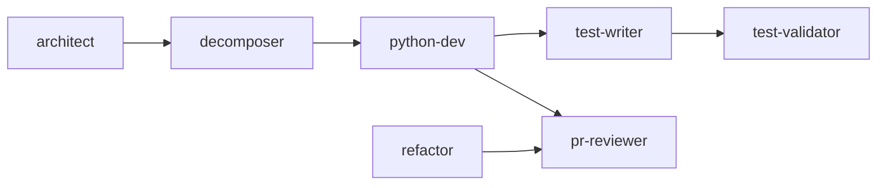

# Copilot Stack

A production-grade GitHub Copilot customization stack for Python backend engineering, tuned for Staff/Principal quality output. It makes code, reviews, tests, refactors, and designs more correct, simpler, and more consistent across a team, and it governs and reproduces itself for other teams.

The stack is language-focused (Python backend) and framework-aware (FastAPI, pytest, asyncio). It is company-neutral: no internal tools or names are baked in. Adapt the defaults per repo.

New here? Start with the [usage guide](USAGE.md) for setup and day-to-day workflows. This file is the reference map.

## Layout

```
AGENTS.md                          global engineering contract (always on)
.github/
  copilot-instructions.md          repo context and capability map (always on)
  instructions/                    path-scoped rules, auto-attached by applyTo
    python.instructions.md         **/*.py
    fastapi.instructions.md        api / routes / routers / endpoints
    tests.instructions.md          test files and conftest
  agents/                          specialized personas, least-privilege tools, pinned models
  skills/                          deep methodology, loaded on demand by description
  prompts/                         /slash-command workflows
  scripts/validate_stack.py        schema and link validator
  workflows/validate-stack.yml     CI gate that runs the validator
```

## How it works

1. **Always-on context.** `AGENTS.md` and `copilot-instructions.md` load on every request: the principles and the Python defaults.
2. **Auto-routing.** An `.instructions.md` file attaches automatically when you edit a path its `applyTo` glob matches.
3. **Agents.** Invoke a persona by name in chat, or let Copilot delegate. Each has a tight tool budget and a pinned model.
4. **Skills.** Loaded progressively when a task matches the skill's description. They hold the depth the agents reference.
5. **Prompts.** Type `/name` to run a workflow.

## Agents

| Agent | Use it to | Class |
|---|---|---|
| `python-dev` | Write or extend production Python | codegen |
| `test-writer` | Generate pytest suites (happy, failure, boundary, concurrency) | codegen |
| `test-validator` | Audit tests for weak assertions and regression-net gaps | reasoning |
| `pr-reviewer` | Principal-level review of a diff | reasoning |
| `refactor` | Behavior-preserving change driven by a named smell | reasoning |
| `architect` | Design docs, ADRs, refactor plans | reasoning |
| `decomposer` | Split a large change into clean, parallel-safe PRs | reasoning |
| `stack-governor` | Audit, eval, build, and evolve the stack itself | reasoning |

Reasoning agents lead with the strongest reasoning model; codegen agents lead with a fast strong coding model. Both pin a prioritized array so there is a graceful fallback.

## Skills

| Skill | Depth on |
|---|---|
| `python-patterns` | Typing, errors, async, resilience, DI, data access |
| `test-patterns` | Writing tests that catch regressions |
| `test-validation` | Auditing tests and detecting tampering |
| `pr-review-patterns` | Severity ladder, full-sweep review checklist |
| `refactor-patterns` | Smell-to-technique catalog (+ `python.md`, `tests.md`) |
| `system-design` | Design docs, ADRs, failure-mode analysis |
| `design-patterns` | Pragmatic, YAGNI-aware pattern selection |
| `decomposition` | Seam analysis and the contract-first PR pattern |
| `observability` | Structured logging, RED metrics, tracing, alerts |
| `stack-governance` | The schema and rubrics behind the governance prompts |

## Prompts

Development: `/implement`, `/write-tests`, `/review-tests`, `/pr-review`, `/security-review`, `/refactor-smell`, `/design-doc`, `/pr-description`, `/commit-message`.

Stack governance: `/audit-stack`, `/optimize-stack`, `/eval-stack`, `/build-team-stack`, `/generate-repo-instructions`.

## The pipeline

For a non-trivial change the agents chain through handoffs. Use only the stages a task needs.



A one-line fix skips straight to `python-dev` or `/implement`. A cross-team change starts at `architect`.

## Adopt it in your repo

1. Copy `AGENTS.md` and the `.github/` stack into your repo.
2. Run `/generate-repo-instructions` to ground `AGENTS.md` and `copilot-instructions.md` in your actual code, commands, and conventions.
3. Trim what you do not need. A tight stack of strong artifacts beats a sprawling one.

To build a stack from scratch for another team, run `/build-team-stack`.

## Govern it

- **Audit:** `/audit-stack` sweeps schema validity, coverage, least privilege, model fit, and freshness.
- **Optimize:** `/optimize-stack` applies the audit findings, correctness first, and re-validates.
- **Eval:** `/eval-stack` runs the graded suites in `evals/` and scores real output quality (correctness lift, review depth, test bite) across versions.
- **Validate:** `python .github/scripts/validate_stack.py` checks frontmatter, tool ids, links, and handoff targets. CI runs it on every stack PR.
- **Gate generated code:** `pyproject.toml` pins the Ruff and mypy-strict rules the agents assume; `.github/workflows/python-quality.yml` enforces them.

## Extending it

Guardrail hooks (`.github/hooks/*.json`) are supported by the platform and can block destructive terminal actions. They are intentionally not included here: add them when a concrete safety need justifies the maintenance, not before.

## House style

No em dashes. No filler. Principle-level tone. Comments explain why, not what. The validator warns on em dashes so the style stays enforced.
