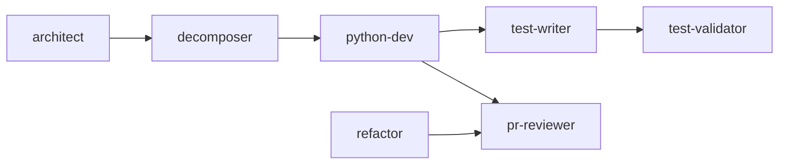

# Using the Copilot Stack

A practical, thorough guide to getting Staff/Principal quality out of this stack every day. Read [.github/README.md](README.md) for the map of what exists; this guide is how to actually use it.

## Contents

- [Setup](#setup)
- [Mental model](#mental-model)
- [How to invoke each piece](#how-to-invoke-each-piece)
- [Core workflows](#core-workflows)
  - [Implement a feature end to end](#implement-a-feature-end-to-end)
  - [Write production code](#write-production-code)
  - [Generate and verify tests](#generate-and-verify-tests)
  - [Review a pull request](#review-a-pull-request)
  - [Write a PR description](#write-a-pr-description)
  - [Refactor safely](#refactor-safely)
  - [Design before you build](#design-before-you-build)
  - [Write a commit message](#write-a-commit-message)
- [The pipeline in practice](#the-pipeline-in-practice)
- [Govern the stack](#govern-the-stack)
- [Scale it to other teams](#scale-it-to-other-teams)
- [Adopt it in your own repo](#adopt-it-in-your-own-repo)
- [How to get 10x, not 1x](#how-to-get-10x-not-1x)
- [Troubleshooting](#troubleshooting)
- [Cheat sheet](#cheat-sheet)

## Setup

1. **Get the files in place.** This repo is the stack. To use it in a product repo, copy `AGENTS.md` and the `.github/` directory into that repo's root. In this repo, it is already in place.
2. **Open the repo in VS Code** with GitHub Copilot enabled. The always-on layer (`AGENTS.md` and `.github/copilot-instructions.md`) loads on every Copilot request automatically; there is nothing to turn on.
3. **Confirm the stack is healthy:**
   ```bash
   python .github/scripts/validate_stack.py
   ```
   You want `Stack validation passed: 0 error(s), 0 warning(s)`.
4. **Find the agents and prompts.** Open the Chat view. Custom agents appear in the chat mode picker; prompts run as `/name` slash commands. If they do not appear, see [Troubleshooting](#troubleshooting).

## Mental model

The stack has four layers. They compose: a request can be shaped by all four at once.

| Layer | Lives in | Loads | Job |
|---|---|---|---|
| Always-on | `AGENTS.md`, `copilot-instructions.md` | Every request | The principles and Python defaults every answer follows |
| Instructions | `.github/instructions/*.instructions.md` | When you edit a matching path | Path-scoped rules (Python, FastAPI, tests) |
| Skills | `.github/skills/*/SKILL.md` | When a task matches the description | The deep methodology agents draw on |
| Agents and prompts | `.github/agents`, `.github/prompts` | When you invoke them | Personas and workflows you drive |

The rule of thumb: **instructions and skills are pulled in for you; agents and prompts you reach for.** You do not manually load a skill; you pick an agent or run a prompt, and the relevant skills come with it.

## How to invoke each piece

- **An agent:** open Chat, select the agent from the mode picker (for example `python-dev` or `pr-reviewer`), and describe the task. Agents also delegate to each other through handoffs.
- **A prompt:** type `/` in Chat and pick the prompt, or type it directly, for example `/pr-review` or `/write-tests src/orders/service.py`. Arguments after the name refine the scope.
- **A skill:** nothing to do. It loads when your task matches its description. You can nudge it by naming the topic ("review the observability of this handler").
- **An instruction:** nothing to do. It attaches when you edit a file its `applyTo` glob matches. Editing any `.py` file pulls in the Python rules; editing a route module adds the FastAPI rules.

## Core workflows

### Implement a feature end to end

The highest-leverage entry point is the `/implement` prompt. It runs the full loop: frame the constraint, plan the minimal change, implement with the failure paths handled, write tests, and self-review before declaring done.

```
/implement Add an endpoint to cancel a pending order. Only the order owner may cancel,
and a shipped order cannot be cancelled.
```

For a larger change, start a step earlier so the design and the PR boundaries are right:

1. `/design-doc` (or the `architect` agent) to frame constraints and pick an approach.
2. Hand off to `decomposer` to split it into clean, parallel-safe PRs.
3. `/implement` or the `python-dev` agent for the first PR.
4. `/write-tests` then `/review-tests`.
5. `/pr-review` before you open the PR.

A one-line fix does not need this. Use `/implement` or `python-dev` directly.

### Write production code

Select the `python-dev` agent when you want code written or extended. It states the driving constraint, writes the least code that solves it with full type hints and handled failure paths, and lists the honest tradeoffs. It pulls in `python-patterns` for depth and obeys the Python instruction files.

```
Implement a pooled httpx client wrapper with a 5s timeout, three bounded retries with
jitter on transport errors, and a propagated correlation id.
```

Expect it to refuse speculative abstraction. If you ask for a factory with one product, it will push back or inline it; that is the YAGNI enforcement working, not a bug.

### Generate and verify tests

Two steps, because writing tests and proving they bite are different jobs.

```
/write-tests src/orders/service.py
```

`test-writer` reads the code, enumerates its branches and boundaries, and writes happy-path, failure-path, and boundary tests, mocking only the I/O seams. Then verify the suite actually protects you:

```
/review-tests tests/orders/test_service.py
```

`test-validator` checks whether each test would fail if the code broke, and flags weak assertions, mocked-under-test, and coverage gaps. Run this on tests you inherited or that changed suspiciously in a diff.

### Review a pull request

```
/pr-review
```

With no argument it reviews your working-tree and staged changes against the base branch. `pr-reviewer` runs the full sweep (correctness, concurrency, security, YAGNI, tests, observability, API compatibility) and returns severity-labeled, question-formatted comments with a verdict and blocking count. For a security-only pass:

```
/security-review
```

Use these before you open the PR, so the machine catches the mechanical issues and human reviewers spend their attention on judgment.

### Write a PR description

```
/pr-description
```

Reads the diff and produces What, Why, Risk and blast radius, Testing, and Rollback. It describes behavior and intent, not a file-by-file changelog, and it flags a change that mixes several concerns with a recommendation to split.

### Refactor safely

```
/refactor-smell god function in orders/service.py
```

`refactor` names the smell, states its detection signal, applies one technique, and runs the existing tests to prove behavior is unchanged. If coverage is thin it adds characterization tests first. If your request mixes several concerns it stops and asks to decompose. Refactor and behavior change never ride together.

### Design before you build

```
/design-doc A rate limiter for the public API. Budget is 10k req/s per tenant,
soft limits, and it must fail open if the limiter backend is down.
```

`architect` reads the code first, states the constraints with numbers, presents two or three real options, decides with the dominating constraint named, and covers failure modes and operational readiness. It matches the artifact to the stakes: an ADR for one decision, a full doc for a cross-team change.

### Write a commit message

Stage your changes, then:

```
/commit-message
```

You get a Conventional Commit with an imperative subject under 72 characters, a body that explains why, and an issue trailer if one is evident. It will tell you if the staged diff mixes concerns that belong in separate commits.

## The pipeline in practice

The agents chain through handoffs so a unit of work flows from design to merge without you re-explaining context each time.



When an agent finishes, it offers the next handoff (for example `python-dev` offers "cover with tests" to `test-writer`). You choose whether to take it. Use only the stages a task needs; most changes start at `python-dev` or `/implement`, and only cross-team or hard-to-reverse work starts at `architect`.

## Govern the stack

Treat the stack as a product. Keep it healthy with these tools.

- **Validate** on every change: `python .github/scripts/validate_stack.py`. CI runs it automatically on any PR that touches the stack.
- **Audit** periodically: `/audit-stack` sweeps schema validity, workflow coverage, redundancy, least-privilege tools, model fit, and freshness, and reports findings by severity.
- **Optimize** from an audit: `/optimize-stack` applies the findings correctness-first and re-validates, closing the loop from report to fix.
- **Evaluate** when you change an artifact: `/eval-stack` runs the graded suites in `evals/` and scores correctness lift, review depth, test bite, and restraint, so you can tell whether a change helped.
- **Gate generated code:** `pyproject.toml` holds the Ruff and mypy-strict rules the agents assume; `.github/workflows/python-quality.yml` enforces them on every PR.

## Scale it to other teams

Two prompts turn one good stack into org-wide leverage.

- **Build a stack for another team:**
  ```
  /build-team-stack Backend team, Python and FastAPI, main pain is slow reviews and flaky tests.
  ```
  `stack-governor` interviews the domain, scaffolds a minimal strong stack (constitution, instructions, skills, least-privilege agents, prompts), and validates it.

- **Generate grounded instructions for an existing repo,** so everyone who clones inherits the same standards:
  ```
  /generate-repo-instructions
  ```
  It reads the repo (language, framework, test runner, lint and type config, CI, conventions) and writes `AGENTS.md` and `copilot-instructions.md` that encode what the code actually does, with real commands and real paths, never invented ones.

## Adopt it in your own repo

1. Copy `AGENTS.md` and `.github/` into your repo.
2. Run `/generate-repo-instructions` to ground the always-on layer in your real code and commands.
3. Trim what you do not need. A tight stack of strong artifacts beats a sprawling one; delete before you add.
4. Run the validator and commit.

## How to get 10x, not 1x

- **Reach for the right specialist.** A review from `pr-reviewer` beats asking a general chat to "look at this." A test audit from `test-validator` beats "are these tests good?"
- **Let the pipeline carry context.** Take the handoffs instead of restarting the conversation; the next agent inherits the work.
- **Trust the YAGNI pushback.** When an agent inlines your abstraction or refuses a speculative flag, that is the stack protecting the codebase. Override only with a real second caller in hand.
- **Verify, do not assume.** Run `/review-tests` on generated tests and `/pr-review` on your own diff before you trust them. The stack raises the floor; you still own the merge.
- **Keep changes small.** If an agent recommends a decomposition, take it. Small PRs are where the quality and the safety live.
- **Feed the stack your standards.** When you correct an agent, encode the lesson in an instruction or skill so it holds next time.

## Troubleshooting

- **An agent or prompt does not appear.** Confirm the file is under `.github/agents` or `.github/prompts` with the right extension (`.agent.md`, `.prompt.md`) and valid frontmatter. Run the validator. Reload the VS Code window.
- **An instruction is not applying.** Check its `applyTo` glob against the path you are editing. The Python rules attach on `**/*.py`; the FastAPI rules only on api, routes, routers, and endpoints paths. Widen the glob if your layout differs.
- **A skill is not being used.** Skills load by description match. Name the topic explicitly in your request, or sharpen the skill's `description` "Use when" triggers.
- **The validator fails on a link.** Relative depth matters: a skill reaching `AGENTS.md` needs `../../../AGENTS.md`, an agent needs `../../AGENTS.md`, an instruction needs `../../AGENTS.md`. The validator prints the exact file and target.
- **An agent used the wrong model.** Check the `model` array in its frontmatter. Reasoning roles lead with the strongest reasoning model; codegen roles lead with a fast coding model.

## Cheat sheet

| I want to | Do this |
|---|---|
| Build a feature | `/implement <task>` |
| Write or extend code | `python-dev` agent |
| Add tests | `/write-tests <file>` |
| Check tests bite | `/review-tests <file>` |
| Review a diff | `/pr-review` |
| Security-only review | `/security-review` |
| PR description | `/pr-description` |
| Refactor a smell | `/refactor-smell <smell + file>` |
| Design something | `/design-doc <problem>` |
| Commit message | `/commit-message` (stage first) |
| Split a big change | `decomposer` agent |
| Audit the stack | `/audit-stack` |
| Apply audit fixes | `/optimize-stack` |
| Score the stack | `/eval-stack` |
| Stack for a team | `/build-team-stack <team + domain>` |
| Instructions for a repo | `/generate-repo-instructions` |
| Validate the stack | `python .github/scripts/validate_stack.py` |
