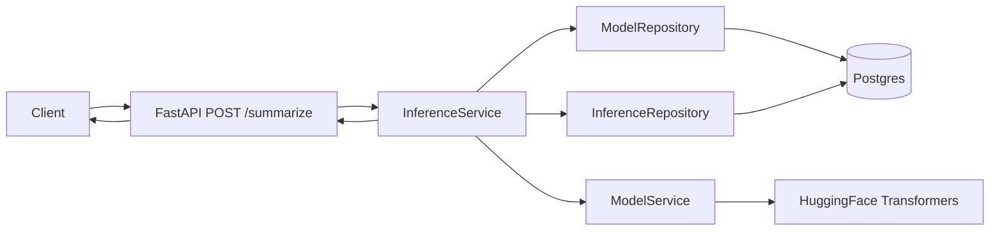
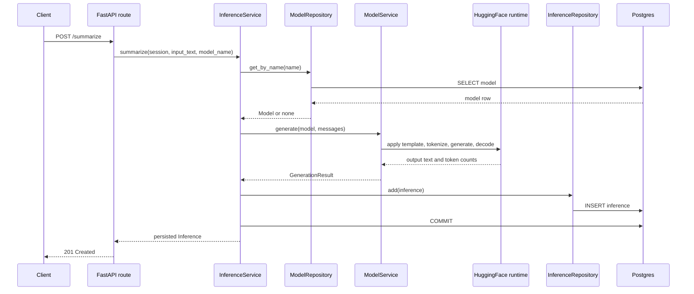

# arc-model-lab Service Architecture

Audience: backend engineers extending or operating the service. Reading time: 12 minutes.

## Purpose

`arc-model-lab` accepts text, runs local model inference, persists the inference
record, and returns the generated result. The current surface is one
summarization endpoint backed by a small model catalog. The service is shaped so
that later capabilities (evaluation, datasets, training) can read from durable
inference records without reworking this core.

## Design principles

Simplicity. The service runs the smallest useful production shape. There is no
provider abstraction, workflow engine, event bus, queue, or plugin framework.
Abstractions appear only after a second concrete caller exists.

Domain first. The two domain concepts, `Model` and `Inference`, match the
language of the system. A `Model` is something the service can load and run. An
`Inference` is one execution of a model against a prompt.

Orthogonal ownership. Each module owns one concern and depends only inward.

| Module | Responsibility |
| --- | --- |
| `api/` | HTTP request and response surface, error mapping |
| `domain/` | Business entities, enums, and domain exceptions |
| `services/` | Business workflows (model loading, inference) |
| `db/` | ORM models, session factory, repositories, seeding |
| `cli/` | Operational catalog commands |
| `config.py` | Environment-driven settings |
| `main.py` | Composition root: lifespan wiring and the ASGI app |

Dependencies flow inward: `api -> services -> db -> domain`. The domain layer
imports only the standard library.

## System architecture



`ModelService` holds an in-process cache of loaded runtimes and is created once
at startup. `InferenceService` carries no per-request state and resolves the
target model from the catalog on each call.

## Domain model

Domain entities are frozen dataclasses with no framework imports.

`Model` (`src/arc_model_lab/domain/model.py`):

```python
@dataclass(frozen=True, slots=True)
class Model:
    name: str
    provider: Provider
    model_id: str
    tokenizer_id: str
    revision: str | None = None
    adapter_path: str | None = None
    status: ModelStatus = ModelStatus.ACTIVE
    id: UUID = field(default_factory=uuid4)
    created_at: datetime = field(default_factory=lambda: datetime.now(UTC))
    updated_at: datetime = field(default_factory=lambda: datetime.now(UTC))
```

`Inference` (`src/arc_model_lab/domain/inference.py`):

```python
@dataclass(frozen=True, slots=True)
class Inference:
    model_id: UUID
    input_text: str
    prompt: str
    output_text: str
    latency_ms: int
    prompt_tokens: int | None = None
    completion_tokens: int | None = None
    id: UUID = field(default_factory=uuid4)
    created_at: datetime = field(default_factory=lambda: datetime.now(UTC))
```

`Provider` currently has one member, `huggingface`. `ModelStatus` is `active`,
`inactive`, or `deprecated`; only `active` models serve inference. The tables
behind these entities are documented in [database-erd.md](database-erd.md).

## Service responsibilities

### ModelService

Owns model loading and text generation. It loads tokenizer and weights on first
use, caches each runtime in process keyed by `name:revision:adapter`, selects the
compute device, renders the tokenizer chat template, generates, and counts prompt
and completion tokens.

Device selection: `auto` prefers CUDA, then MPS, then CPU. An explicitly
requested accelerator that is unavailable raises `ModelLoadError` rather than
silently falling back to CPU.

It does not touch HTTP, the database, or prompt policy.

### InferenceService

Owns the summarization workflow: enforce the input size limit, resolve the model
by name, reject non-active models, build chat messages, call `ModelService`,
assemble the `Inference`, persist it through the repository, and commit. It
returns the persisted domain entity.

It does not touch HuggingFace internals or ORM types.

### Repositories

`ModelRepository` and `InferenceRepository` translate between ORM rows and domain
entities. They accept and return domain objects only; ORM types never leak past
this boundary. Transaction control belongs to the caller: the service commits,
and the request-scoped session rolls back on error.

## Request lifecycle



## Persistence guarantee

A successful response requires a persisted row. `InferenceService.summarize`
commits before returning, and the route serializes the persisted entity. The
request-scoped session in `get_session` rolls back on any exception, so a failed
generation or write never returns a success. The `inference` table is
append-only in normal operation.

## Error handling

Domain errors are raised in the service layer and mapped to HTTP responses by
`register_exception_handlers` in `src/arc_model_lab/api/errors.py`. Load and
generation failures are logged with their cause; the client receives a safe
message.

| Condition | Exception | Status |
| --- | --- | --- |
| Empty `input_text` | Pydantic validation | 422 |
| Input over 50,000 characters | `InputTooLargeError` | 413 |
| Unknown model name | `ModelNotFoundError` | 404 |
| Model not active | `ModelInactiveError` | 409 |
| Weights or tokenizer fail to load | `ModelLoadError` | 503 |
| Generation fails | `GenerationError` | 500 |
| Success | | 201 |

## Model catalog and operations

The catalog is seeded from JSON and managed from a CLI, so no model coordinates
are hardcoded in the request path.

Seeding (`src/arc_model_lab/db/seed_models.py`) reads `seeds/models.local.json`
and performs an idempotent upsert keyed by `name`. The `--check` flag validates
the file without writing.

The CLI (`src/arc_model_lab/cli/models.py`) supports `list`, `get`, `activate`,
`deactivate`, and `smoke` (load a model and run one summary). `activate` and
`deactivate` toggle `status`, which gates whether `/summarize` will use a model.

## Configuration

Settings live in one `config.py` using pydantic-settings, read from environment
variables with the `ARC_` prefix and an optional `.env`. `get_settings()` is
cached. See `.env.example` for the full set. Groups:

- Database: `ARC_DATABASE_URL`, `ARC_DB_ECHO`.
- Default model identity: `ARC_MODEL_NAME`, `ARC_MODEL_PROVIDER`, `ARC_MODEL_ID`,
  `ARC_TOKENIZER_ID`, `ARC_ADAPTER_PATH`.
- Compute device: `device` (`auto`, `cpu`, `mps`, `cuda`).
- Generation: `ARC_MAX_INPUT_TOKENS`, `ARC_MAX_NEW_TOKENS`, `ARC_NUM_BEAMS`.
- Server: `ARC_API_HOST`, `ARC_API_PORT`.

Production secrets belong in a secret store, not committed `.env` files. The
database URL carries credentials, so it is supplied at deploy time.

## Runtime and deployment

The app is synchronous end to end. Model inference is CPU or GPU bound and
blocking; synchronous route handlers run in the FastAPI threadpool, so the event
loop is never blocked. No async database or task queue is introduced.

`main.py` builds the app in `create_app` and wires singletons in the lifespan:
the SQLAlchemy engine, session factory, `ModelService`, and `InferenceService`
are attached to `app.state` at startup and disposed on shutdown.

The image is a multi-stage `uv` build on `python:3.13-slim`, runs as a non-root
user, and does not bake model weights. Weights download at first request into a
mounted HuggingFace cache volume. In `compose.yaml` the API container applies
migrations, seeds the catalog, then serves. Postgres has a health check and the
API waits for it.

## Testing strategy

| Layer | Location | Focus |
| --- | --- | --- |
| Unit | `tests/unit/` | Prompt construction, domain, model service with a faked runtime, inference orchestration, config, CLI, seeding |
| Integration | `tests/integration/` | Repositories and a smoke path against real Postgres via testcontainers |
| API | `tests/api/` | `/summarize` happy path and each error mapping |

Integration tests are marked `@pytest.mark.integration` and require Docker. CI
does not download model weights; the model runtime is faked so tests stay fast
and deterministic. Coverage runs with branch coverage enabled.

## Continuous integration

`.github/workflows/ci.yml` runs on pull requests and pushes to `main`:

| Job | Checks |
| --- | --- |
| `quality` | Ruff format check, Ruff lint, mypy on `src` |
| `tests` | pytest with coverage |
| `migrations` | `alembic upgrade head` then `alembic check` against Postgres 16 |
| `seed` | Validate `seeds/models.local.json` |
| `docker-build` | Build the image with layer caching |
| `security` | `pip-audit` on exported requirements (advisory) |

## Security posture

- Database access is parameterized through the ORM. No SQL string interpolation.
- Error responses carry safe messages; load and generation failure causes go to
  logs, not to clients.
- Input text is stored in the database and is not emitted at application log
  level.
- The container runs as a non-root user and excludes model artifacts from the
  image.
- Input size is capped at 50,000 characters before tokenization; the tokenizer
  additionally truncates to `ARC_MAX_INPUT_TOKENS`.

## Deferred capabilities

These are intentionally absent until a concrete need exists: evaluation results,
experiments, datasets, prompt versioning, training runs, a model registry,
multi-provider inference, async or streaming inference, an event bus, and
OpenTelemetry tracing.

The next capability is evaluation, which depends on durable inference records. It
closes the first feedback loop: generate output, persist inference, evaluate
output, persist score.
