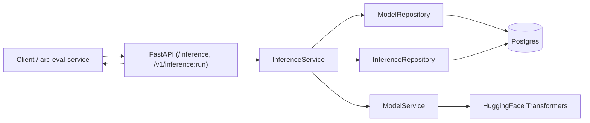
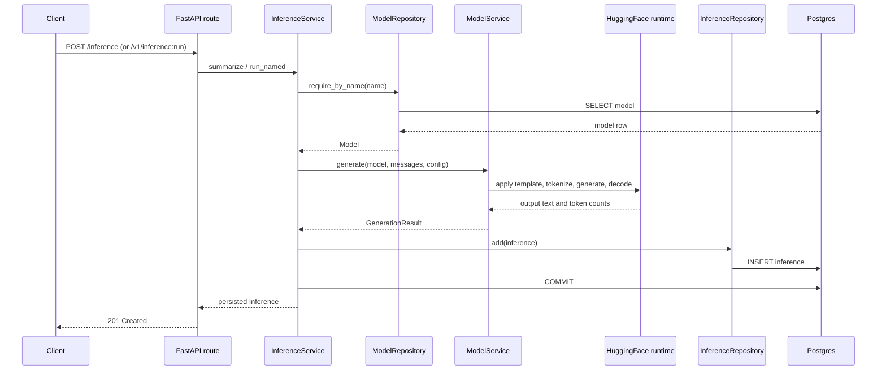

# arc-model-lab Service Architecture

Audience: backend engineers extending or operating the service. Reading time: 8 minutes.

## Purpose

`arc-model-lab` takes text, runs a local model, saves the result, and returns it.
The caller names the model and an optional decoding config; the service resolves
the model from its catalog, generates, persists one inference row, and returns it.
It never scores its output: scoring and experimentation live in the separate
arc-eval-service, which calls back into this service to run a candidate model.

Two write endpoints produce inference rows:

- `POST /inference`, online serving. Serves only active models.
- `POST /v1/inference:run`, the service-to-service seam arc-eval-service calls to
  run a candidate model (which may be inactive) with an explicit generation config.

## Design principles

Simplicity. The service runs the smallest useful production shape. There is no
provider abstraction, workflow engine, event bus, queue, or plugin framework.
Abstractions appear only after a second concrete caller exists.

Domain first. The domain concepts match the language of the system. A `Model` is
something the service can load and run. An `Inference` is one execution of a model
against a prompt. That is the whole domain: the lab stores models and inferences,
nothing else.

Orthogonal ownership. Each module owns one concern and depends only inward.

| Module | Responsibility |
| --- | --- |
| `api/` | HTTP request and response surface, error mapping |
| `domain/` | Business entities, enums, and domain exceptions |
| `services/` | Business workflows (model loading, inference) |
| `db/` | ORM models, session factory, repositories, seeding |
| `cli/` | Operational catalog commands |
| `config.py` | Environment-driven settings |
| `main.py` | Composition root: lifespan wiring and the ASGI app |

Dependencies flow inward: `api -> services -> db -> domain`. The domain layer
imports only the standard library.

## System architecture



`ModelService` keeps an in-process cache of loaded model runtimes and is created
once at startup. `InferenceService` holds no per-request state and resolves the
model named in each request from the catalog. The service has no outbound
dependency; arc-eval-service depends on it (over HTTP) to run an inference.

## Domain model

Domain entities are frozen dataclasses with no framework imports.

`Model` (`src/arc_model_lab/domain/model.py`):

```python
@dataclass(frozen=True, slots=True)
class Model:
    name: str
    provider: Provider
    model_id: str
    tokenizer_id: str
    revision: str | None = None
    adapter_path: str | None = None
    status: ModelStatus = ModelStatus.ACTIVE
    id: UUID = field(default_factory=uuid4)
    created_at: datetime = field(default_factory=lambda: datetime.now(UTC))
    updated_at: datetime = field(default_factory=lambda: datetime.now(UTC))
```

`Inference` (`src/arc_model_lab/domain/inference.py`):

```python
@dataclass(frozen=True, slots=True)
class Inference:
    model_id: UUID
    input_text: str
    prompt: str
    output_text: str
    latency_ms: int
    prompt_tokens: int | None = None
    completion_tokens: int | None = None
    id: UUID = field(default_factory=uuid4)
    created_at: datetime = field(default_factory=lambda: datetime.now(UTC))
```

`GenerationConfig` (`src/arc_model_lab/domain/generation.py`) is the decoding
config (`temperature`, `max_output_tokens`); it validates its own bounds in
`__post_init__`, so no construction path can build an out-of-range config.
`Provider` currently has one member, `huggingface`. `ModelStatus` is `active`,
`inactive`, or `deprecated`; `/inference` serves only `active` models. The tables
behind these entities are in [database-erd.md](database-erd.md).

## Service responsibilities

### ModelService

Owns model loading and text generation. It loads tokenizer and weights on first
use, caches each runtime in process keyed by `name:revision:adapter`, selects the
compute device, renders the tokenizer chat template, generates, and counts prompt
and completion tokens.

Device selection: `auto` prefers CUDA, then MPS, then CPU. An explicitly
requested accelerator that is unavailable raises `ModelLoadError` rather than
silently falling back to CPU.

It does not touch HTTP, the database, or prompt policy.

### InferenceService

Owns the summarization workflow: enforce the input size limit, resolve the model
by name, build chat messages, call `ModelService`, assemble the `Inference`,
persist it through the repository, and commit. It returns the persisted domain
entity. A single private resolver gates model resolution:

- `summarize` (for `/inference`) resolves with `allow_inactive=False`, so a
  non-active model is a `409`. Decoding defaults to the server config; the caller
  may override `temperature` only.
- `run_named` (for `/v1/inference:run`) resolves with the caller's `allow_inactive`
  and takes a full `GenerationConfig`, so arc-eval-service can run an inactive
  candidate model before it is activated.

Generation is blocking, so the service offloads it to a worker thread
(`asyncio.to_thread`) rather than blocking the event loop. It does not touch
HuggingFace internals or ORM types.

### Repositories

`ModelRepository` and `InferenceRepository` translate between ORM rows and domain
entities. They accept and return domain objects only; ORM types never leak past
this boundary. Transaction control belongs to the caller: the service commits, and
the request-scoped session rolls back on error.

## Request lifecycle



The two endpoints share this sequence; they differ only in model resolution
(`/inference` requires an active model and defaults decoding; `/v1/inference:run`
takes an explicit config and may allow an inactive model).

## Persistence guarantee

A successful response requires a persisted row. The service commits before
returning, and the route serializes the persisted entity. The request-scoped
session in `get_session` rolls back on any exception, so a failed generation or
write never returns a success. The `inference` table is append-only in normal
operation.

## Error handling

Domain errors are raised in the service layer and mapped to HTTP responses by
`register_exception_handlers` in `src/arc_model_lab/api/errors.py`. Load and
generation failures are logged with their cause; the client receives a safe
message.

| Condition | Exception | Status |
| --- | --- | --- |
| Empty `input_text` | Pydantic validation | 422 |
| Input over 50,000 characters | `InputTooLargeError` | 413 |
| Unknown model referenced | `ModelNotFoundError` | 404 |
| Model not active (`/inference`, or `/v1/inference:run` without `allow_inactive`) | `ModelInactiveError` | 409 |
| Unknown inference referenced (on read) | `InferenceNotFoundError` | 404 |
| Invalid generation config | `InvalidGenerationConfigError` | 422 |
| Weights or tokenizer fail to load | `ModelLoadError` | 503 |
| Generation fails | `GenerationError` | 500 |
| Success | | 201 |

## Model catalog and operations

The catalog is seeded from JSON and managed from a CLI, so no model coordinates
are hardcoded in the request path.

Seeding (`src/arc_model_lab/db/seed_models.py`) reads `seeds/models.local.json`
and performs an idempotent upsert keyed by `name`. The `--check` flag validates
the file without writing.

The CLI (`src/arc_model_lab/cli/models.py`) supports `list`, `get`, `activate`,
`deactivate`, and `smoke` (load a model and run one summary). `activate` and
`deactivate` toggle `status`, which gates online serving: `/inference` serves only
active models (a non-active model is a 409). `/v1/inference:run` can bypass the
gate with `allow_inactive`, so arc-eval-service can score a candidate before it is
activated.

## Configuration

Settings live in one `config.py` using pydantic-settings, read from environment
variables with the `ARC_` prefix and an optional `.env`. `get_settings()` is
cached. See `.env.example` for the full set. Groups:

- Database: `ARC_DATABASE_URL`, `ARC_DB_ECHO`.
- Default model: `ARC_MODEL_NAME` resolves a catalog model by name; weights cache
  at `ARC_MODEL_CACHE_DIR`. Model identity (provider, ids, adapter) lives in the
  catalog, not settings.
- Compute device: `ARC_DEVICE` (`auto`, `cpu`, `mps`, `cuda`).
- Generation: `ARC_MAX_INPUT_TOKENS`, `ARC_MAX_OUTPUT_TOKENS`, `ARC_TEMPERATURE`.
- Server: `ARC_API_HOST`, `ARC_API_PORT`.

Production secrets belong in a secret store, not committed `.env` files. The
database URL carries credentials, so it is supplied at deploy time.

## Runtime and deployment

The app is async end to end (async SQLAlchemy engine, async routes). Model
inference is CPU or GPU bound and blocking; `InferenceService` offloads generation
to a worker thread (`asyncio.to_thread`) so the event loop is never blocked.

`main.py` builds the app in `create_app` and wires singletons in the lifespan: the
async engine, the session factory, `ModelService`, `InferenceService`, and
`ModelCatalogService` are attached to `app.state` at startup, and the engine is
disposed on shutdown.

The image is a multi-stage `uv` build on `python:3.13-slim`, runs as a non-root
user, and does not bake model weights. Weights download at first request into a
mounted HuggingFace cache volume. In `compose.yaml` the API container applies
migrations, seeds the catalog, then serves. Postgres has a health check and the
API waits for it.

## Testing strategy

| Layer | Location | Focus |
| --- | --- | --- |
| Unit | `tests/unit/` | Prompt construction, domain, the inference service with fakes, config, CLI, seeding, error boundary |
| Integration | `tests/integration/` | Repositories and the online path against real Postgres |
| API | `tests/api/` | `/inference`, `/v1/inference:run`, and the model endpoints: happy path and each error mapping |

DB-backed tests are marked `@pytest.mark.integration`. They prefer a Postgres
testcontainer and fall back to a local cluster (`initdb`) when the container
registry is blocked; set `ARC_SKIP_TESTCONTAINER=1` to skip the container attempt.
CI does not download model weights; the model runtime is faked so tests stay fast
and deterministic. Coverage runs with branch coverage enabled and is enforced.

## Continuous integration

`.github/workflows/ci.yml` runs on pull requests and pushes to `main`:

| Job | Checks |
| --- | --- |
| `quality` | Ruff format check, Ruff lint, mypy on `src` |
| `tests` | pytest with coverage |
| `migrations` | Alembic migrations applied and reversed against Postgres 16 |
| `seed` | Validate `seeds/models.local.json` |
| `docker-build` | Build the image with layer caching |
| `security` | `pip-audit` on exported requirements (advisory) |

## Security posture

- Database access is parameterized through the ORM. No SQL string interpolation.
- Error responses carry safe messages; load and generation failure causes go to
  logs, not to clients.
- Input text is stored in the database and is not emitted at application log level.
- The container runs as a non-root user and excludes model artifacts from the image.
- Input size is capped at 50,000 characters before tokenization; the tokenizer
  additionally truncates to `ARC_MAX_INPUT_TOKENS`.
- `POST /v1/inference:run` can run an inactive model with arbitrary decoding, a
  privileged operation. It has no authentication today; gating it to
  arc-eval-service's workload identity is a tracked follow-up before it is exposed
  beyond a trusted network.

## Deferred capabilities

These are intentionally absent until a concrete need exists: datasets, prompt
versioning, training runs, a model registry, multi-provider inference, streaming
inference, an event bus, and OpenTelemetry tracing.

Experiments and evaluation used to live here; they moved to arc-eval-service, which
owns metrics, judges, scores, experiments, and comparison. The lab is now a focused
model-serving service: it runs a named model and persists the inference, and
arc-eval-service reads that output by id when it scores an experiment run.
