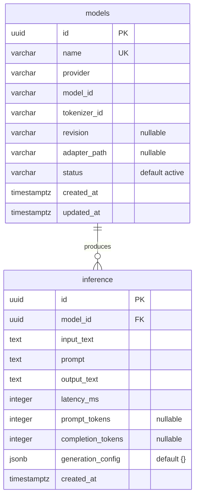

# arc-model-lab Database Schema

Audience: backend engineers working on persistence or migrations. Reading time: 3 minutes.

The service persists two tables in PostgreSQL 16: `models` (the inference model
catalog) and `inference` (one row per executed inference). The schema is owned by
Alembic migrations in `migrations/` and mirrored by the SQLAlchemy ORM in
`src/arc_model_lab/db/models.py`.

Scoring and experimentation live in the separate arc-eval-service, which owns its
own database. arc-model-lab is pure model serving: it runs a model and stores the
inference; it never stores scores. The two services do not call each other:
arc-platform runs an inference here, collects the output, and hands that input and
output to arc-eval-service as data to score.

## Entity relationship diagram

## Table: models

The catalog of loadable inference models. `name` is the stable handle used by API
requests and the CLI; the HuggingFace coordinates (`model_id`, `tokenizer_id`,
`revision`) are loading details.

| Column | Type | Nullable | Default | Notes |
| --- | --- | --- | --- | --- |
| `id` | uuid | no | application | Primary key, generated in the app with `uuid4` |
| `name` | varchar(255) | no | | Unique catalog handle |
| `provider` | varchar(255) | no | | Runtime family; currently only `huggingface` |
| `model_id` | varchar(255) | no | | HuggingFace model identifier |
| `tokenizer_id` | varchar(255) | no | | HuggingFace tokenizer identifier |
| `revision` | varchar(255) | yes | null | Pinned model revision; null loads the default |
| `adapter_path` | varchar(1024) | yes | null | Optional LoRA adapter path |
| `status` | varchar(32) | no | `active` | One of `active`, `inactive`, `deprecated` |
| `created_at` | timestamptz | no | `now()` | Row creation time (DB default) |
| `updated_at` | timestamptz | no | `now()` | Refreshed on update via ORM `onupdate` |

Constraints:

- `pk_models` primary key on (`id`).
- `uq_models_name` unique on (`name`).
- `ck_models_valid_status` check: `status IN ('active', 'inactive', 'deprecated')`.

`updated_at` is maintained by SQLAlchemy (`onupdate=func.now()`), not a database
trigger. A write that bypasses the ORM will not refresh it.

## Table: inference

One row per executed inference, written by `POST /inference` (online serving).
This is the durable record; rows are append-only and are not deleted in normal
operation. arc-platform reads a row by id and hands its input and output to
arc-eval-service for scoring; the lab itself never scores.

| Column | Type | Nullable | Default | Notes |
| --- | --- | --- | --- | --- |
| `id` | uuid | no | application | Primary key, generated in the app with `uuid4` |
| `model_id` | uuid | no | | Foreign key to `models.id` |
| `input_text` | text | no | | Original user payload |
| `prompt` | text | no | | Rendered chat prompt sent to the model |
| `output_text` | text | no | | Generated model output |
| `latency_ms` | integer | no | | Generation wall-clock time in milliseconds |
| `prompt_tokens` | integer | yes | null | Prompt token count when available |
| `completion_tokens` | integer | yes | null | Completion token count when available |
| `generation_config` | jsonb | no | `'{}'` | Resolved decoding config the row was produced with |
| `created_at` | timestamptz | no | `now()` | Row creation time (DB default) |

Constraints:

- `pk_inference` primary key on (`id`).
- `fk_inference_model_id_models` foreign key (`model_id`) references `models(id)`
  `ON DELETE RESTRICT`.

`generation_config` records the decoding settings (`temperature`,
`max_output_tokens`, and any future knob) each inference was produced with, so the
row alone reproduces the call. It is JSONB, not columns, because the knob set is
open and evolving. A row written before this column existed carries `'{}'`, which
rehydrates to the greedy default. The API response does not expose it; it is
persistence-only provenance today.

## History

Migrations `0003` through `0005` added `evaluation_results`, `experiments`, and
`experiment_runs` when the lab owned scoring and experiments. Migration `0006`
drops all three: that concern moved to arc-eval-service. The downgrade recreates
them empty for reversibility, but the migrated rows are not restored by it.
Migration `0007` adds `inference.generation_config` as a metadata-only column add
(constant default, no table rewrite), so it takes only a brief lock.
