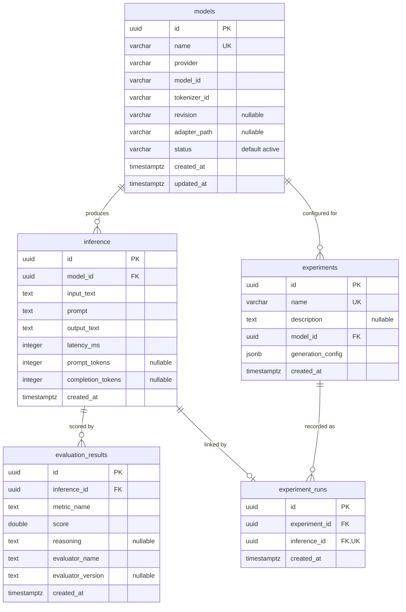

# arc-model-lab Database Schema

Audience: backend engineers working on persistence or migrations. Reading time: 6 minutes.

The service persists five tables in PostgreSQL 16: `models` (the inference model
catalog), `inference` (one row per executed inference), `evaluation_results`
(one metric score per row, written when an experiment run asks for scoring),
`experiments` (a named, reusable run configuration), and `experiment_runs` (the
link between an experiment and each inference it produced). The schema is owned by
Alembic migrations in `migrations/` and mirrored by the SQLAlchemy ORM in
`src/arc_model_lab/db/models.py`.

## Entity relationship diagram

## Table: models

The catalog of loadable inference models. `name` is the stable handle used by API
requests and the CLI; the HuggingFace coordinates (`model_id`, `tokenizer_id`,
`revision`) are loading details.

| Column | Type | Nullable | Default | Notes |
| --- | --- | --- | --- | --- |
| `id` | uuid | no | application | Primary key, generated in the app with `uuid4` |
| `name` | varchar(255) | no | | Unique catalog handle |
| `provider` | varchar(255) | no | | Runtime family; currently only `huggingface` |
| `model_id` | varchar(255) | no | | HuggingFace model identifier |
| `tokenizer_id` | varchar(255) | no | | HuggingFace tokenizer identifier |
| `revision` | varchar(255) | yes | null | Pinned model revision; null loads the default |
| `adapter_path` | varchar(1024) | yes | null | Optional LoRA adapter path |
| `status` | varchar(32) | no | `active` | One of `active`, `inactive`, `deprecated` |
| `created_at` | timestamptz | no | `now()` | Row creation time (DB default) |
| `updated_at` | timestamptz | no | `now()` | Refreshed on update via ORM `onupdate` |

Constraints:

- `pk_models` primary key on (`id`).
- `uq_models_name` unique on (`name`).
- `ck_models_valid_status` check: `status IN ('active', 'inactive', 'deprecated')`.

`updated_at` is maintained by SQLAlchemy (`onupdate=func.now()`), not a database
trigger. A write that bypasses the ORM will not refresh it.

## Table: inference

One row per executed summarization. This is the durable record that later
capabilities (evaluation, dataset extraction, regression analysis) read from, so
rows are append-only and are not deleted in normal operation.

| Column | Type | Nullable | Default | Notes |
| --- | --- | --- | --- | --- |
| `id` | uuid | no | application | Primary key, generated in the app with `uuid4` |
| `model_id` | uuid | no | | Foreign key to `models.id` |
| `input_text` | text | no | | Original user payload |
| `prompt` | text | no | | Rendered chat prompt sent to the model |
| `output_text` | text | no | | Generated model output |
| `latency_ms` | integer | no | | Generation wall-clock time in milliseconds |
| `prompt_tokens` | integer | yes | null | Prompt token count when available |
| `completion_tokens` | integer | yes | null | Completion token count when available |
| `created_at` | timestamptz | no | `now()` | Row creation time (DB default) |

Constraints:

- `pk_inference` primary key on (`id`).
- `fk_inference_model_id_models` foreign key (`model_id`) references `models(id)`
  `ON DELETE RESTRICT`.

## Table: evaluation_results

One metric score for one inference, written by the scoring step when a request
asks for it. One metric per row (not a JSON blob) keeps scores easy to query,
index, and aggregate. This is a lean local copy of the score; `arc-eval` keeps its
own richer record (judge, prompt, latency) in its own database.

| Column | Type | Nullable | Default | Notes |
| --- | --- | --- | --- | --- |
| `id` | uuid | no | application | Primary key, generated in the app with `uuid4` |
| `inference_id` | uuid | no | | Foreign key to `inference.id`; the scored inference |
| `metric_name` | text | no | | The metric that produced the score, for example `faithfulness` |
| `score` | double precision | no | | The metric score |
| `reasoning` | text | yes | null | Short rationale from the evaluator, when provided |
| `evaluator_name` | text | no | | The evaluator that scored the metric |
| `evaluator_version` | text | yes | null | Evaluator version, when provided |
| `created_at` | timestamptz | no | `now()` | Row creation time (DB default) |

Constraints:

- `pk_evaluation_results` primary key on (`id`).
- `fk_evaluation_results_inference_id_inference` foreign key (`inference_id`)
  references `inference(id)` `ON DELETE CASCADE`.
- `uq_evaluation_results_inference_metric_evaluator` unique on (`inference_id`,
  `metric_name`, `evaluator_name`).

The unique key is what makes replay and backfill idempotent: re-scoring an
inference updates the existing row for that metric and evaluator instead of adding
a duplicate. `ON DELETE CASCADE` means deleting an inference also removes its
scores, since a score has no meaning without the inference it describes.

## Table: experiments

A named, reusable run configuration: a model plus the decoding knobs a run should
use. It holds no results itself; the outputs it produced are reached through
`experiment_runs`.

| Column | Type | Nullable | Default | Notes |
| --- | --- | --- | --- | --- |
| `id` | uuid | no | application | Primary key, generated in the app with `uuid4` |
| `name` | varchar(255) | no | | Unique, human-readable experiment name |
| `description` | text | yes | null | Optional free-text description |
| `model_id` | uuid | no | | Foreign key to `models.id`; the model under test |
| `generation_config` | jsonb | no | | Decoding config (`temperature`, `max_output_tokens`) |
| `created_at` | timestamptz | no | `now()` | Row creation time (DB default) |

Constraints:

- `pk_experiments` primary key on (`id`).
- `uq_experiments_name` unique on (`name`).
- `fk_experiments_model_id_models` foreign key (`model_id`) references
  `models(id)` `ON DELETE RESTRICT`.

An experiment targets a chosen model even if it is not active, so a candidate
model can be evaluated before it is promoted. `RESTRICT` keeps the model row
alive while any experiment references it.

## Table: experiment_runs

The link between an experiment and one inference it produced. It lives in its own
table, not as a column on `inference`, so an inference never references an
experiment: inference stays orthogonal to experiments. One row is written at the
end of each experiment run.

| Column | Type | Nullable | Default | Notes |
| --- | --- | --- | --- | --- |
| `id` | uuid | no | application | Primary key, generated in the app with `uuid4` |
| `experiment_id` | uuid | no | | Foreign key to `experiments.id` |
| `inference_id` | uuid | no | | Foreign key to `inference.id`; unique |
| `created_at` | timestamptz | no | `now()` | Row creation time (DB default) |

Constraints:

- `pk_experiment_runs` primary key on (`id`).
- `fk_experiment_runs_experiment_id_experiments` foreign key (`experiment_id`)
  references `experiments(id)` `ON DELETE CASCADE`.
- `fk_experiment_runs_inference_id_inference` foreign key (`inference_id`)
  references `inference(id)` `ON DELETE CASCADE`.
- `uq_experiment_runs_inference_id` unique on (`inference_id`).
- `ix_experiment_runs_experiment_id` index on (`experiment_id`).

The unique `inference_id` means an inference belongs to at most one experiment
run. Both foreign keys cascade: deleting an experiment or an inference removes the
link row, never the inference itself (deleting an experiment leaves its inferences
in place, only unlinked).

## Relationships

`models` to `inference` is one to many. Every `inference` row references exactly
one model (`model_id` is not null); a model may have zero or more inferences.

`ON DELETE RESTRICT` blocks deletion of a model while any inference references it.
This preserves the provenance of stored inferences: a model row cannot disappear
out from under the records it produced. To retire a model, set `status` to
`inactive` or `deprecated` rather than deleting the row.

`inference` to `evaluation_results` is also one to many. Every score references
exactly one inference; an inference has zero or more scores, one per metric.
Unlike the model relationship, this one cascades: deleting an inference removes
its scores too.

`models` to `experiments` is one to many, under the same `RESTRICT` rule: a model
cannot be deleted while an experiment references it.

`experiments` to `experiment_runs` is one to many; `inference` to
`experiment_runs` is one to zero-or-one (the unique `inference_id`). An experiment
run is the associative row that ties one experiment to one inference. Both sides
cascade on delete, so removing an experiment or an inference clears the link rows
without stranding them.

## Indexes

`models` and `inference` carry only the indexes their constraints create:

- `pk_models`, `pk_inference` (primary keys).
- `uq_models_name` (unique on `models.name`).

There is no standalone index on `inference.model_id` or `inference.created_at`.
Filtering or joining large inference volumes by model or time will plan
sequential scans. Covering indexes are deferred until query patterns and data
volume justify the write cost.

`evaluation_results` is indexed for its read paths: `inference_id`, `metric_name`,
and `created_at` each have a b-tree index, alongside the unique key on
(`inference_id`, `metric_name`, `evaluator_name`). These keep score-by-inference,
score-by-metric, and time-window queries off sequential scans.

`experiment_runs` carries the unique key on (`inference_id`) and a b-tree index on
(`experiment_id`), the column the score aggregation joins on. `experiments`
carries only its primary key and the unique name index.

## Migration lineage

| Revision | File | Change |
| --- | --- | --- |
| `0001_initial` | `migrations/versions/0001_initial.py` | Creates `models` and `inference` with primary keys and the `inference -> models` foreign key |
| `0002_model_catalog_fields` | `migrations/versions/0002_model_catalog_fields.py` | Adds `models.revision`, `models.status`, `models.updated_at`, and the `ck_models_valid_status` check |
| `0003_evaluation_results` | `migrations/versions/0003_evaluation_results.py` | Creates `evaluation_results` with its foreign key to `inference`, the unique key, and the read indexes |
| `0004_experiments` | `migrations/versions/0004_experiments.py` | Creates `experiments` and (historically) a nullable `inference.experiment_id` |
| `0005_experiment_runs` | `migrations/versions/0005_experiment_runs.py` | Adds `experiment_runs`, backfills existing links, and drops `inference.experiment_id` so inference no longer references experiments |

Constraint names are deterministic because `Base.metadata` sets a naming
convention in `src/arc_model_lab/db/base.py`. Keep it in place so autogenerated
migrations stay stable.

## ORM and domain mapping

Each table maps to one ORM record and one frozen domain dataclass. Repositories
in `src/arc_model_lab/db/repositories.py` translate between them; ORM types never
cross that boundary.

| Table | ORM record | Domain entity |
| --- | --- | --- |
| `models` | `ModelRecord` | `Model` |
| `inference` | `InferenceRecord` | `Inference` |
| `evaluation_results` | `EvaluationResultRecord` | `EvaluationResult` |
| `experiments` | `ExperimentRecord` | `Experiment` |
| `experiment_runs` | `ExperimentRunRecord` | `ExperimentRun` |

The domain entities and the service flow that writes these rows are described in
[architecture.md](architecture.md).
