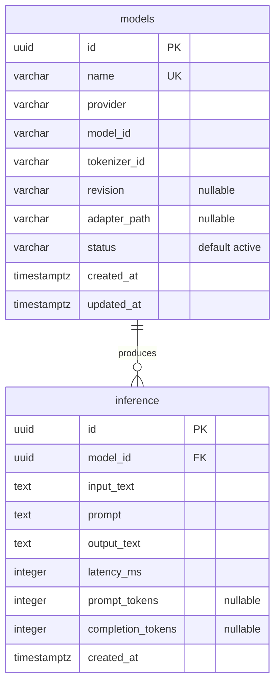

# arc-model-lab Database Schema

Audience: backend engineers working on persistence or migrations. Reading time: 6 minutes.

The service persists two tables in PostgreSQL 16: `models` (the inference model
catalog) and `inference` (one row per executed summarization). The schema is
owned by Alembic migrations in `migrations/` and mirrored by the SQLAlchemy ORM
in `src/arc_model_lab/db/models.py`.

## Entity relationship diagram

## Table: models

The catalog of loadable inference models. `name` is the stable handle used by API
requests and the CLI; the HuggingFace coordinates (`model_id`, `tokenizer_id`,
`revision`) are loading details.

| Column | Type | Nullable | Default | Notes |
| --- | --- | --- | --- | --- |
| `id` | uuid | no | application | Primary key, generated in the app with `uuid4` |
| `name` | varchar(255) | no | | Unique catalog handle |
| `provider` | varchar(255) | no | | Runtime family; currently only `huggingface` |
| `model_id` | varchar(255) | no | | HuggingFace model identifier |
| `tokenizer_id` | varchar(255) | no | | HuggingFace tokenizer identifier |
| `revision` | varchar(255) | yes | null | Pinned model revision; null loads the default |
| `adapter_path` | varchar(1024) | yes | null | Optional LoRA adapter path |
| `status` | varchar(32) | no | `active` | One of `active`, `inactive`, `deprecated` |
| `created_at` | timestamptz | no | `now()` | Row creation time (DB default) |
| `updated_at` | timestamptz | no | `now()` | Refreshed on update via ORM `onupdate` |

Constraints:

- `pk_models` primary key on (`id`).
- `uq_models_name` unique on (`name`).
- `ck_models_valid_status` check: `status IN ('active', 'inactive', 'deprecated')`.

`updated_at` is maintained by SQLAlchemy (`onupdate=func.now()`), not a database
trigger. A write that bypasses the ORM will not refresh it.

## Table: inference

One row per executed summarization. This is the durable record that later
capabilities (evaluation, dataset extraction, regression analysis) read from, so
rows are append-only and are not deleted in normal operation.

| Column | Type | Nullable | Default | Notes |
| --- | --- | --- | --- | --- |
| `id` | uuid | no | application | Primary key, generated in the app with `uuid4` |
| `model_id` | uuid | no | | Foreign key to `models.id` |
| `input_text` | text | no | | Original user payload |
| `prompt` | text | no | | Rendered chat prompt sent to the model |
| `output_text` | text | no | | Generated model output |
| `latency_ms` | integer | no | | Generation wall-clock time in milliseconds |
| `prompt_tokens` | integer | yes | null | Prompt token count when available |
| `completion_tokens` | integer | yes | null | Completion token count when available |
| `created_at` | timestamptz | no | `now()` | Row creation time (DB default) |

Constraints:

- `pk_inference` primary key on (`id`).
- `fk_inference_model_id_models` foreign key (`model_id`) references `models(id)`
  `ON DELETE RESTRICT`.

## Relationships

`models` to `inference` is one to many. Every `inference` row references exactly
one model (`model_id` is not null); a model may have zero or more inferences.

`ON DELETE RESTRICT` blocks deletion of a model while any inference references it.
This preserves the provenance of stored inferences: a model row cannot disappear
out from under the records it produced. To retire a model, set `status` to
`inactive` or `deprecated` rather than deleting the row.

## Indexes

The only indexes present are those created implicitly by constraints:

- `pk_models`, `pk_inference` (primary keys).
- `uq_models_name` (unique on `models.name`).

There is no standalone index on `inference.model_id` or `inference.created_at`.
Filtering or joining large inference volumes by model or time will plan
sequential scans. Covering indexes are deferred until query patterns and data
volume justify the write cost.

## Migration lineage

| Revision | File | Change |
| --- | --- | --- |
| `0001_initial` | `migrations/versions/0001_initial.py` | Creates `models` and `inference` with primary keys and the `inference -> models` foreign key |
| `0002_model_catalog_fields` | `migrations/versions/0002_model_catalog_fields.py` | Adds `models.revision`, `models.status`, `models.updated_at`, and the `ck_models_valid_status` check |

Constraint names are deterministic because `Base.metadata` sets a naming
convention in `src/arc_model_lab/db/base.py`. Keep it in place so autogenerated
migrations stay stable.

## ORM and domain mapping

Each table maps to one ORM record and one frozen domain dataclass. Repositories
in `src/arc_model_lab/db/repositories.py` translate between them; ORM types never
cross that boundary.

| Table | ORM record | Domain entity |
| --- | --- | --- |
| `models` | `ModelRecord` | `Model` |
| `inference` | `InferenceRecord` | `Inference` |

The domain entities and the service flow that writes these rows are described in
[architecture.md](architecture.md).
