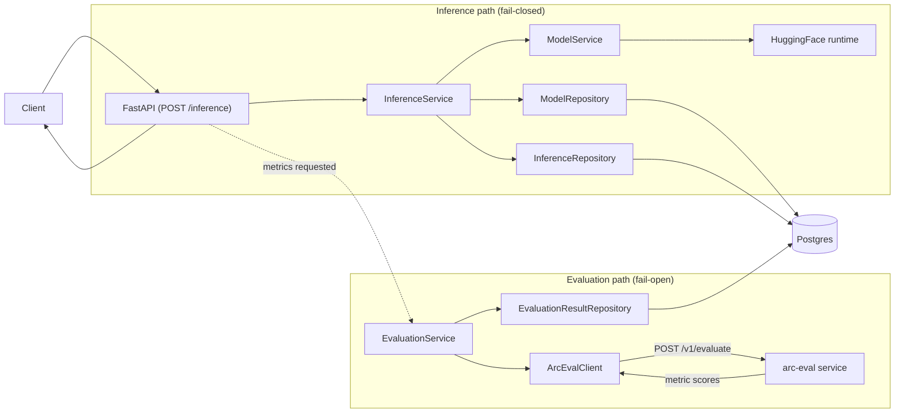
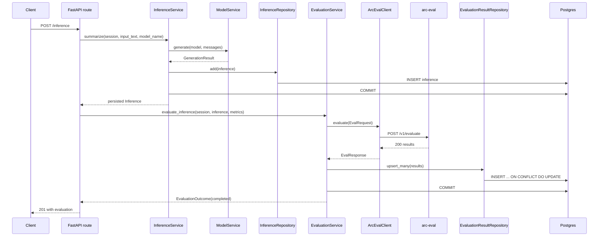
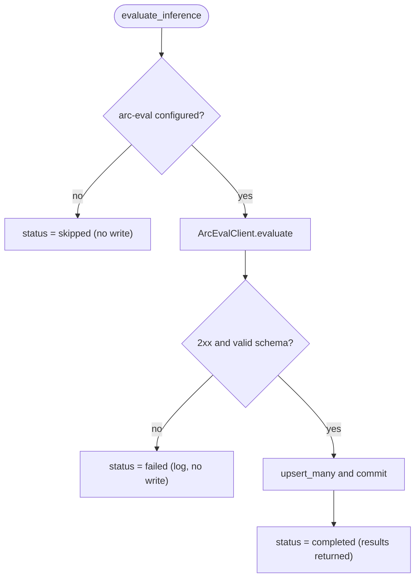
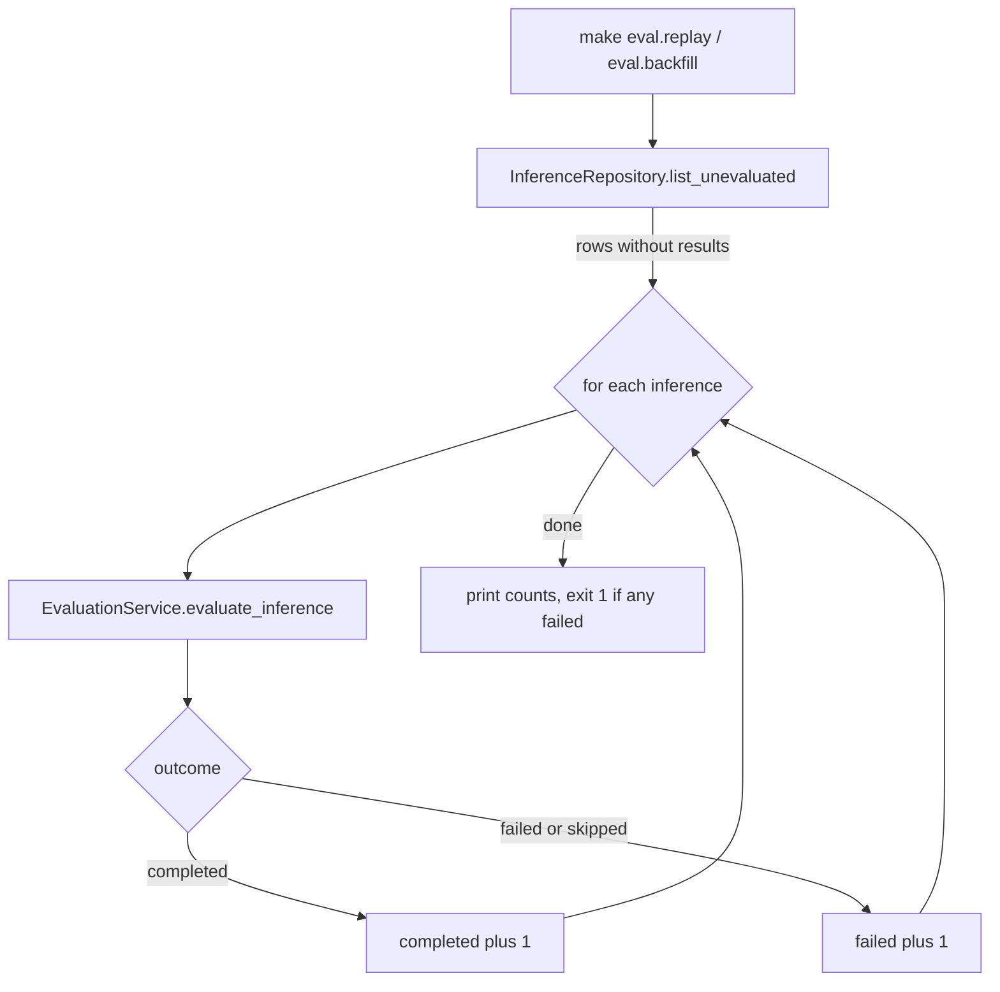
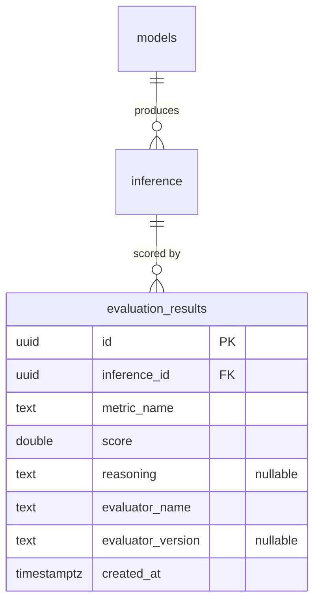

# arc-model-lab Data Flow

Audience: backend engineers extending or operating the service. Reading time: 8 minutes.

The service turns text into a durable inference record, then optionally into
quality scores. The pipeline is `Model -> Inference -> EvaluationResult`.
Inference and evaluation are separate service boundaries: inference runs locally
against a HuggingFace model, evaluation is an HTTP call to the `arc-eval`
service. The entity schema is in [database-erd.md](database-erd.md); the module
layout is in [architecture.md](architecture.md).

## End-to-end data flow

Evaluation is opt-in per request: a caller that names one or more `metrics` gets
its output scored against them; omitting `metrics` skips evaluation. When metrics
are requested it makes a scoring call if an `arc-eval` URL is configured, and is
skipped without error otherwise. The inference path is fail-closed (a failure
returns an error and stores nothing); the evaluation path is fail-open (a
transport or schema failure still returns the stored summary), except an unknown
metric, which is a caller error surfaced as 404.

## Online request: inference with evaluation

The route commits the inference before it calls evaluation, so the two run in
separate transactions. `arc-eval` scores the requested `metrics` (or, without an
explicit list, the metrics for the task type: `summarization` maps to
faithfulness and answer relevance), persists its own copy, and returns only the
metrics that scored.

## Evaluation outcome states

`EvaluationService.evaluate_inference` returns one of three states. Only
`completed` writes rows.

| Status | Trigger | Persistence | Response |
| --- | --- | --- | --- |
| `skipped` | `ARC_EVAL_SERVICE_URL` empty | none | `evaluation.status = skipped` |
| `failed` | transport error, non-2xx, or unparseable body | none | summary returned, `status = failed` |
| `completed` | scores returned (list may be empty) | upsert | scores in `evaluation.results` |

A failed call raises `EvaluationError` inside `ArcEvalClient`; the service
catches it, logs a warning, and returns `failed`. The already-committed inference
is untouched.

## Transaction boundaries

Inference and evaluation never share a transaction.

- `InferenceService.summarize` inserts and commits the `inference` row, then
  returns. A failure here returns an error status and stores nothing.
- `EvaluationService.evaluate_inference` runs after that commit. It writes
  `evaluation_results` in its own transaction. A failure leaves the inference row
  in place and returns `failed`.

This ordering is why evaluation cannot corrupt inference storage: the durable
record exists before the eval call is attempted.

## Backfill and replay

Inferences created before evaluation existed, or whose evaluation failed, are
scored from the CLI in `src/arc_model_lab/cli/evaluations.py`. `list_unevaluated`
selects `inference` rows with no matching `evaluation_results` (`NOT EXISTS`),
optionally bounded by a `created_at` window for `backfill`.

Batch runs are fail-closed per item: a failed item is counted and the loop
continues; the command exits non-zero if any item failed. Because writes upsert
on the unique metric key, a command is safe to re-run.

`make eval.run ID=<uuid>` scores a single inference by id through the same
`evaluate_inference` path.

## Data lineage

Each inference belongs to one model; each inference has zero or more evaluation
results, one row per metric. The unique key
`(inference_id, metric_name, evaluator_name)` is what makes replay idempotent.

The `models` and `inference` columns are in [database-erd.md](database-erd.md).
The `evaluation_results` table is created by
`migrations/versions/0003_evaluation_results.py`.

## Configuration touchpoints

Evaluation reads its own settings (`EvalSettings`, prefix `ARC_EVAL_`), separate
from the app settings.

| Variable | Effect |
| --- | --- |
| `ARC_EVAL_SERVICE_URL` | Base URL of `arc-eval`. Empty means a request that asks for metrics gets evaluation `skipped`. |
| `ARC_EVAL_TIMEOUT_SECONDS` | Per-request timeout for the `arc-eval` call. |

The client is built once at startup in `main.py` (`build_arc_eval_client`). When
the URL is empty the service holds no client and short-circuits to `skipped`.
