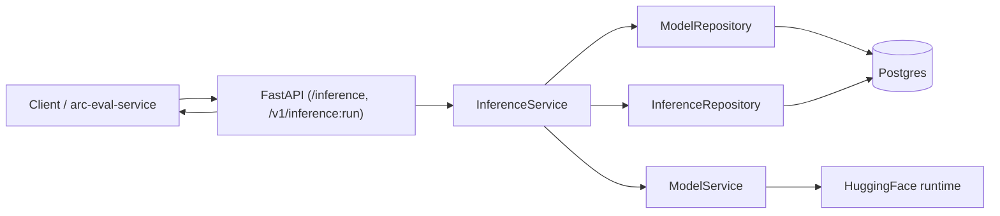
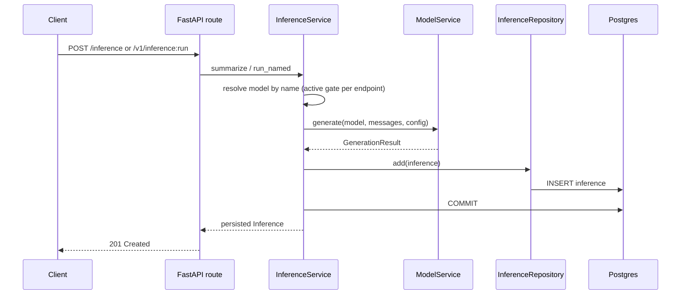
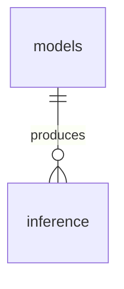

# arc-model-lab Data Flow

Audience: backend engineers extending or operating the service. Reading time: 4 minutes.

The service turns text into one durable inference record. The pipeline is
`Model -> Inference`: resolve the named model, generate, persist. There is no
scoring path in the lab; quality scores and experiments live in the separate
arc-eval-service. The entity schema is in [database-erd.md](database-erd.md); the
module layout is in [architecture.md](architecture.md).

## End-to-end data flow

Two endpoints write an inference row through the same path. `POST /inference` is
online serving (active models only, server-default decoding with an optional
`temperature` override). `POST /v1/inference:run` is the service-to-service seam
arc-eval-service calls to run a candidate model with an explicit generation config,
optionally allowing an inactive model. Both are fail-closed: a failure returns an
error and stores nothing.

## Request path

Generation is CPU or GPU bound and blocking; `InferenceService` runs it in a worker
thread (`asyncio.to_thread`) so the async event loop is never blocked.

## Transaction boundary

One request, one transaction, one committed row. The service inserts the
`inference` row and commits before returning; the request-scoped session rolls back
on any exception. A failed generation or write returns an error and stores nothing,
so a successful response always corresponds to a persisted row. The `inference`
table is append-only in normal operation.

## Model resolution

The two endpoints differ only in how they resolve the model:

| Endpoint | Model gate | Decoding |
| --- | --- | --- |
| `POST /inference` | Active only; a non-active model is `409` | Server default; caller may override `temperature` |
| `POST /v1/inference:run` | Active, unless the caller sets `allow_inactive` | Explicit `GenerationConfig` (`temperature`, `max_output_tokens`) |

An unknown model name is `404` on both. `allow_inactive` lets arc-eval-service run
a candidate model before it is activated.

## Data lineage

Each inference belongs to one model. That is the whole lineage the lab keeps:

Scores are not stored here. arc-eval-service receives an inference's id in the
response and keeps it as correlation metadata when it scores the output; the
authoritative scores live in that service's own database. The `models` and
`inference` columns are in [database-erd.md](database-erd.md).
