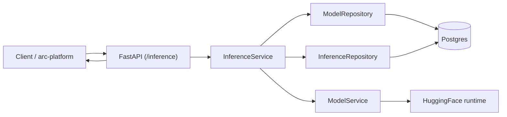
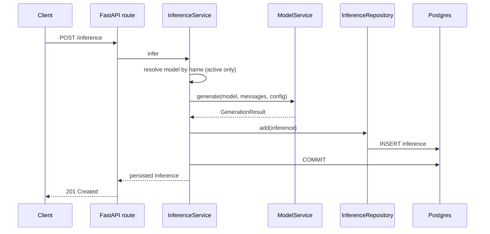
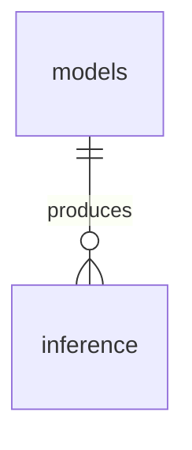

# arc-model-lab Data Flow

Audience: backend engineers extending or operating the service. Reading time: 4 minutes.

The service turns text into one durable inference record. The pipeline is
`Model -> Inference`: resolve the named model, generate, persist. There is no
scoring path in the lab; quality scores and experiments live in the separate
arc-eval-service. The entity schema is in [database-erd.md](database-erd.md); the
module layout is in [architecture.md](architecture.md).

## End-to-end data flow

`POST /inference` writes one inference row. It is online serving: active models
only, server-default decoding with an optional `temperature` override. It is
fail-closed: a failure returns an error and stores nothing. The lab and
arc-eval-service do not call each other; arc-platform orchestrates them.

## Request path

Generation is CPU or GPU bound and blocking; `InferenceService` runs it in a worker
thread (`asyncio.to_thread`) so the async event loop is never blocked.

## Transaction boundary

One request, one transaction, one committed row. The service inserts the
`inference` row and commits before returning; the request-scoped session rolls back
on any exception. A failed generation or write returns an error and stores nothing,
so a successful response always corresponds to a persisted row. The `inference`
table is append-only in normal operation.

## Model resolution

`POST /inference` resolves the model by name and serves it only when active:

| Endpoint | Model gate | Decoding |
| --- | --- | --- |
| `POST /inference` | Active only; a non-active model is `409` | Server default; caller may override `temperature` |

An unknown model name is `404`.

## Data lineage

Each inference belongs to one model. That is the whole lineage the lab keeps:

Scores are not stored here. arc-platform collects the output and hands the
inference's input and output to arc-eval-service as data to score; the authoritative
scores live in that service's own database, which carries no reference back to this
one. Each inference row also records the resolved decoding config it was produced
with (`generation_config`). The `models` and `inference` columns are in
[database-erd.md](database-erd.md).
