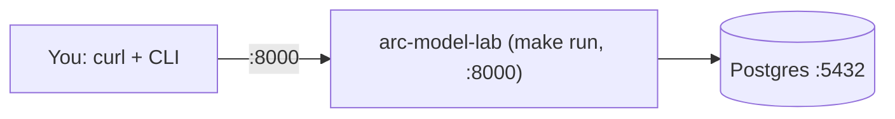

# End-to-end testing: inference

Audience: engineers validating the lab locally. Reading time: 6 minutes.

This is a copy-paste walkthrough. You will start `arc-model-lab`, run inference
over both endpoints, read the rows back, and confirm they persisted. The lab is
pure model serving: it stores inferences and never scores them. Scoring and
experiments live in arc-eval-service, which has its own end-to-end guide.

## What you will run

One service and its database:



## Prerequisites

- macOS or Linux, with [`uv`](https://docs.astral.sh/uv/), Docker + Docker Compose,
  `curl`, and [`jq`](https://jqlang.github.io/jq/).
- This repository checked out.

Set the repo path once (adjust to where you cloned it):

```bash
export ML=~/playground/arc/arc-model-lab
```

Use two terminals: **Terminal A** runs the server and stays open; **Terminal B**
runs the test commands.

## Reset to a fresh database

Skip this the first time. Use it whenever you want to wipe every inference and
start from an empty schema. The data lives in a Docker named volume
(`arc-model-lab_arc_pgdata`); deleting that volume is what resets the database,
and migrations recreate the schema on the next start. Run everything in
**Terminal B**, and stop the `make run` server in **Terminal A** first.

Confirm the volume name if you are unsure:

```bash
docker volume ls | grep arc-model-lab        # -> arc-model-lab_arc_pgdata, arc-model-lab_hf_cache
```

**Wipe the database only** (keeps the downloaded model weights, so the next
inference stays fast):

```bash
cd "$ML"
docker compose down                          # stop containers, keep volumes
docker volume rm arc-model-lab_arc_pgdata    # delete only the database volume
docker compose up -d postgres                # recreate an empty database
make migrate                                 # reapply the schema
make model.seed                              # re-seed the model catalog
```

**Wipe everything** (database and the HuggingFace weight cache):

```bash
cd "$ML"
docker compose down -v                       # remove all volumes: DB + hf_cache
docker compose up -d postgres
make migrate
make model.seed
```

`docker compose down -v` also deletes the `arc-model-lab_hf_cache` volume, so the
next inference re-downloads the model weights (slower first call). Prefer the
database-only reset unless you also want to reclaim the weight cache.

## Setup: start arc-model-lab

In **Terminal B**, prepare the database and catalog:

```bash
cd "$ML"
cp .env.example .env                          # first time only
docker compose up -d postgres                 # Postgres on :5432
uv sync                                        # create the venv
make migrate                                   # apply schema (loads .env)
make model.seed                                # seed the model catalog
docker compose exec postgres psql -U arc -d arc_model_lab -c \
  "SELECT name, status FROM models;"           # confirm: qwen2.5-1.5b-instruct, gemma-3-1b-it
```

In **Terminal A**, start the server and leave it running:

```bash
cd "$ML"
make run                                        # serves on http://localhost:8000
```

Back in **Terminal B**, confirm it is up:

```bash
curl -s localhost:8000/health | jq            # -> {"status":"ok"}
```

## Walkthrough

Run the commands below in **Terminal B**. Every request body is shown as a JSON
block you can paste straight into the interactive docs: open
[`/docs`](http://localhost:8000/docs), pick the endpoint, choose **Try it out**,
paste the JSON into **Request body**, and press **Execute**. The `curl` command
after each block sends the same body from the terminal.

### 1. Health check

```bash
curl -s localhost:8000/health | jq            # -> {"status":"ok"}
```

### 2. Run a plain inference

`POST /inference` runs an active model and stores one row. The first call downloads
the model weights and may take a minute; later calls are fast.

Request body:

```json
{
  "model_name": "qwen2.5-1.5b-instruct",
  "input_text": "The city council approved a plan to add 20 miles of protected bike lanes over three years, funded by a state grant. Supporters say the lanes cut commute times; critics worry about reduced parking."
}
```

Send it, print the stored row, and keep its id for the next step:

```bash
RESP=$(curl -s localhost:8000/inference \
  -H 'content-type: application/json' \
  -d '{
    "model_name": "qwen2.5-1.5b-instruct",
    "input_text": "The city council approved a plan to add 20 miles of protected bike lanes over three years, funded by a state grant. Supporters say the lanes cut commute times; critics worry about reduced parking."
  }')

echo "$RESP" | jq                             # the stored inference row
INFERENCE_ID=$(echo "$RESP" | jq -r '.id')
echo "inference id: $INFERENCE_ID"
```

The response is the stored inference. It carries no scores: `/inference` is pure
inference.

### 3. Read it back and list recent rows

```bash
curl -s localhost:8000/inference/$INFERENCE_ID | jq       # one inference by id
curl -s "localhost:8000/inference?limit=5" | jq           # recent, newest first
```

### 4. Run the service-to-service endpoint

`POST /v1/inference:run` is what arc-eval-service calls. It takes an explicit
generation config and can run an inactive candidate model.

Request body:

```json
{
  "model_name": "qwen2.5-1.5b-instruct",
  "input_text": "The city council approved a plan to add 20 miles of protected bike lanes over three years, funded by a state grant. Supporters say the lanes cut commute times; critics worry about reduced parking.",
  "generation_config": {
    "temperature": 0.0,
    "max_output_tokens": 256
  },
  "allow_inactive": true
}
```

```bash
curl -s localhost:8000/v1/inference:run \
  -H 'content-type: application/json' \
  -d '{
    "model_name": "qwen2.5-1.5b-instruct",
    "input_text": "The city council approved a plan to add 20 miles of protected bike lanes over three years, funded by a state grant. Supporters say the lanes cut commute times; critics worry about reduced parking.",
    "generation_config": { "temperature": 0.0, "max_output_tokens": 256 },
    "allow_inactive": true
  }' | jq
```

### 5. Confirm the active-model gate

`/inference` serves only active models. Deactivate one and watch it return `409`,
then confirm `/v1/inference:run` still runs it with `allow_inactive`.

Deactivate the model:

```bash
docker compose exec postgres psql -U arc -d arc_model_lab -c \
  "UPDATE models SET status='inactive' WHERE name='gemma-3-1b-it';"
```

`POST /inference` for the inactive model now returns `409`. Request body:

```json
{
  "model_name": "gemma-3-1b-it",
  "input_text": "Summarize: the museum extended its weekend hours for the summer."
}
```

```bash
curl -s -o /dev/null -w '%{http_code}\n' localhost:8000/inference \
  -H 'content-type: application/json' \
  -d '{
    "model_name": "gemma-3-1b-it",
    "input_text": "Summarize: the museum extended its weekend hours for the summer."
  }'                                                                   # -> 409
```

`POST /v1/inference:run` with `allow_inactive: true` still runs it. Request body:

```json
{
  "model_name": "gemma-3-1b-it",
  "input_text": "Summarize: the museum extended its weekend hours for the summer.",
  "allow_inactive": true
}
```

```bash
curl -s -o /dev/null -w '%{http_code}\n' localhost:8000/v1/inference:run \
  -H 'content-type: application/json' \
  -d '{
    "model_name": "gemma-3-1b-it",
    "input_text": "Summarize: the museum extended its weekend hours for the summer.",
    "allow_inactive": true
  }'                                                                   # -> 201
```

Reactivate the model:

```bash
docker compose exec postgres psql -U arc -d arc_model_lab -c \
  "UPDATE models SET status='active' WHERE name='gemma-3-1b-it';"
```

### 6. Verify the rows in the database

```bash
cd "$ML"
docker compose exec postgres psql -U arc -d arc_model_lab -c \
  "SELECT id, left(output_text, 50) AS output FROM inference ORDER BY created_at DESC LIMIT 5;"
```

You should see the rows from steps 2 and 4. There are no score or experiment tables
in the lab: those live in arc-eval-service.

## Troubleshooting

| Symptom | Cause | Fix |
| --- | --- | --- |
| `404` on `/inference` | Model name not in the catalog | `make model.seed` (registers the seed models) |
| `409` on `/inference` | Model is not active | Set `status` to `active` in `seeds/models.local.json`, then `make model.seed` |
| First inference is slow | Weights downloading on first use | Wait; later calls are fast |
| `413` too large | Input over 50,000 characters | Shorten the input |

## See also

- [usage.md](usage.md): the endpoints in detail.
- Scoring and experiments end to end: `docs/end-to-end-testing.md` in the
  arc-eval-service repository. Experiments call back into this service over
  `POST /v1/inference:run`, so start arc-model-lab first.
