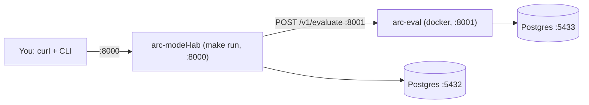

# End-to-end testing: inference, experiments, and evaluation

Audience: engineers validating the full stack locally. Reading time: 15 minutes.

This is a copy-paste walkthrough. You will start `arc-model-lab`, run a plain
inference, then use an experiment to run the full loop: infer, store, score with
`arc-eval`, and read the results back. Each step is a runnable block.

The test sequence follows the request: **infer first, then experiments and
evaluation**.

> Prefer the browser? The same endpoints, with clean copy-paste JSON bodies for
> the FastAPI `/docs` UI, are collected in
> [Testing every endpoint from the `/docs` UI](#testing-every-endpoint-from-the-docs-ui).

## What you will run

Two services on your machine, on separate ports so nothing clashes:



- **arc-model-lab** is the system under test. It runs from source with `make run`
  on port `8000`, backed by its own Postgres on `5432`.
- **arc-eval** is the scorer. It runs in Docker on port `8001`, backed by its own
  Postgres on `5433`. It is only needed once you start scoring (step 5 onward);
  plain inference (steps 1 to 4) does not touch it.

## Prerequisites

- macOS or Linux, with [`uv`](https://docs.astral.sh/uv/), Docker + Docker
  Compose, `curl`, and [`jq`](https://jqlang.github.io/jq/) installed.
- Both repositories checked out side by side: `arc-model-lab/` and
  `arc-eval-service/`.
- For scoring (step 5 onward): an OpenAI API key, or any OpenAI-compatible
  endpoint (Ollama, vLLM, LM Studio). Without a judge, the pipeline still runs;
  the scores just come back empty.

Set the two repo paths once so the commands below are copy-paste ready. Adjust to
where you cloned them:

```bash
export ML=~/playground/arc/arc-model-lab
export EVAL=~/playground/arc/arc-eval-service
```

You will use **two terminals**:

- **Terminal A** runs the `arc-model-lab` server and stays open.
- **Terminal B** runs everything else (arc-eval setup and all the test commands).
  Run `export ML=... EVAL=...` in both.

> macOS `sed -i ''` is used below to edit `.env` files in place. On Linux, drop
> the empty `''` and use `sed -i` instead.

---

## Setup A: start arc-model-lab (the system under test)

In **Terminal B**, prepare the database and catalog:

```bash
cd "$ML"
cp .env.example .env                         # first time only

# Point arc-model-lab at the scorer it will use in step 5.
sed -i '' 's#^ARC_EVAL_SERVICE_URL=.*#ARC_EVAL_SERVICE_URL=http://localhost:8001#' .env

docker compose up -d postgres                # Postgres on :5432
uv sync                                       # create the venv
make migrate                                  # apply schema (loads .env)
make model.seed                               # seed the model catalog
make model.list                               # confirm: qwen2.5-1.5b-instruct, gemma-3-1b-it
```

Now, in **Terminal A**, start the server and leave it running:

```bash
cd "$ML"
make run                                      # serves on http://localhost:8000
```

Back in **Terminal B**, confirm it is up:

```bash
curl -s localhost:8000/health | jq            # -> {"status":"ok"}
```

That is enough to run inference. Do Setup B before step 5.

## Setup B: start arc-eval (the scorer)

Needed for scoring (steps 5, 7, and 8). Skip it for now if you only want to test
inference.

In **Terminal B**:

```bash
cd "$EVAL"
cp .env.example .env                          # first time only

# Use ports that do not clash with arc-model-lab (:8000 and :5432).
sed -i '' 's/^ARC_EVAL_API_PORT=.*/ARC_EVAL_API_PORT=8001/' .env
sed -i '' 's/^POSTGRES_PORT=.*/POSTGRES_PORT=5433/' .env
```

Configure a judge model. Pick one:

- **OpenAI (simplest).** The default profile in `.env` already targets
  `gpt-4o-mini`. Open `.env` and replace `OPENAI_API_KEY=sk-replace-me` with your
  real key. Do not commit it.
- **Local, no key (Ollama).** Requires `ollama serve` with a pulled model (for
  example `ollama pull llama3.1`). In `.env`, replace the `ARC_EVAL_MODEL_PROFILES`
  line with this single-quoted value; the container reaches your host at
  `host.docker.internal`:

  ```dotenv
  ARC_EVAL_MODEL_PROFILES='[{"name":"default","provider":"openai_compatible","model":"llama3.1","base_url":"http://host.docker.internal:11434/v1"}]'
  ```

Bring it up and wait for health:

```bash
docker compose up -d --build                  # db (:5433) + eval-service (:8001)
curl -s localhost:8001/health | jq            # -> {"status":"ok","service":"arc-eval-service"}
```

Optional: score one interaction directly, to prove the judge works before wiring
it through arc-model-lab:

```bash
curl -s localhost:8001/v1/evaluate -H 'content-type: application/json' -d '{
  "input_text": "Paris is the capital of France.",
  "output_text": "Paris is the capital.",
  "prompt": "Summarize the text.",
  "metrics": ["faithfulness", "answer_relevance"],
  "metadata": {"inference_id": "smoke-1"}
}' | jq
```

You should see a `results` array with a `score` per metric. An empty array means
the judge is misconfigured (see [Troubleshooting](#troubleshooting)).

---

## Walkthrough

Run everything below in **Terminal B**. A sample article is reused across steps;
`jq` builds each request body so the text quotes safely.

```bash
export ARTICLE="The city council approved a plan to add 20 miles of protected bike lanes over the next three years, funded by a state transportation grant. Supporters say the lanes will cut commute times and reduce accidents; critics worry about reduced parking on main streets."
```

### 1. Health check

```bash
curl -s localhost:8000/health | jq            # -> {"status":"ok"}
```

### 2. Run a plain inference

`POST /inference` runs the model and stores one row. The first call downloads the
model weights and may take a minute; later calls are fast.

```bash
RESP=$(curl -s localhost:8000/inference \
  -H 'content-type: application/json' \
  -d "$(jq -n --arg m qwen2.5-1.5b-instruct --arg t "$ARTICLE" '{model_name:$m, input_text:$t}')")

echo "$RESP" | jq                             # the stored inference row
INFERENCE_ID=$(echo "$RESP" | jq -r '.id')
echo "inference id: $INFERENCE_ID"
```

The response is the stored inference. Note what is **not** there: no
`experiment_id` and no `evaluation`. `/inference` is pure inference.

### 3. Create an experiment

An experiment pins a model and a decoding config under a name.

```bash
RESP=$(curl -s localhost:8000/experiments \
  -H 'content-type: application/json' \
  -d '{"name":"qwen-greedy","model_name":"qwen2.5-1.5b-instruct","generation_config":{"temperature":0.0,"max_output_tokens":256}}')

echo "$RESP" | jq                             # the created experiment
EXP_A=$(echo "$RESP" | jq -r '.id')
echo "experiment A: $EXP_A"
```

### 4. Run the experiment without scoring

Omit `metrics` to infer and link the run to the experiment, without calling
`arc-eval`. This works even if Setup B is not done yet.

```bash
curl -s localhost:8000/experiments/$EXP_A/run \
  -H 'content-type: application/json' \
  -d "$(jq -n --arg t "$ARTICLE" '{input_text:$t}')" | jq
```

The response carries `experiment_id` (this run belongs to the experiment) and
`evaluation: null` (nothing was scored). The inference row itself still holds no
experiment id; the link lives in the `experiment_runs` table.

### 5. Run the experiment with scoring (the full loop)

This needs Setup B. Naming `metrics` makes the run infer, store, call `arc-eval`,
persist the scores, and record the link.

```bash
RUN=$(curl -s localhost:8000/experiments/$EXP_A/run \
  -H 'content-type: application/json' \
  -d "$(jq -n --arg t "$ARTICLE" '{input_text:$t, metrics:["faithfulness","answer_relevance"]}')")

echo "$RUN" | jq
echo "$RUN" | jq '.evaluation.status'         # -> "completed"
echo "$RUN" | jq '.evaluation.results'        # per-metric scores
```

`evaluation.status` should be `completed` with a score per metric. If it is
`skipped` or `failed`, or `completed` with an empty `results`, see
[Troubleshooting](#troubleshooting).

### 6. Read the aggregated results

`results` averages each metric across every scored run of the experiment.

```bash
curl -s localhost:8000/experiments/$EXP_A/results | jq
```

### 7. Compare two experiments

Create a second experiment with different decoding, score it on the same input,
then compare.

```bash
# A creative variant (higher temperature)
EXP_B=$(curl -s localhost:8000/experiments \
  -H 'content-type: application/json' \
  -d '{"name":"qwen-creative","model_name":"qwen2.5-1.5b-instruct","generation_config":{"temperature":0.9,"max_output_tokens":256}}' \
  | jq -r '.id')

curl -s localhost:8000/experiments/$EXP_B/run \
  -H 'content-type: application/json' \
  -d "$(jq -n --arg t "$ARTICLE" '{input_text:$t, metrics:["faithfulness","answer_relevance"]}')" > /dev/null

# Scores for both experiments, side by side
curl -s localhost:8000/experiments/$EXP_A/compare/$EXP_B | jq
```

### 8. Score an existing inference from the CLI

Evaluation is not only for experiments. Score an inference row that already
exists, for example the plain inference from step 2, over the API or the CLI.

Over the API (`POST /inference/{id}/evaluate`):

```bash
curl -s localhost:8000/inference/$INFERENCE_ID/evaluate \
  -H 'content-type: application/json' \
  -d '{"metrics":["faithfulness","answer_relevance"]}' | jq
```

Or from the CLI:

```bash
cd "$ML"
make eval.run ID=$INFERENCE_ID                # default metric set

# or choose metrics explicitly
uv run python -m arc_model_lab.cli.evaluations run \
  --inference-id $INFERENCE_ID \
  --metrics faithfulness answer_relevance

# score every inference that has no scores yet
make eval.replay
```

### 9. Verify the rows in the database

Confirm each service persisted what it should.

arc-model-lab (inference, the experiment link, and its local score copy):

```bash
cd "$ML"
docker compose exec postgres psql -U arc -d arc_model_lab -c \
  "SELECT id, left(output_text,50) AS output FROM inference ORDER BY created_at DESC LIMIT 5;"
docker compose exec postgres psql -U arc -d arc_model_lab -c \
  "SELECT experiment_id, inference_id FROM experiment_runs ORDER BY created_at DESC LIMIT 5;"
docker compose exec postgres psql -U arc -d arc_model_lab -c \
  "SELECT inference_id, metric_name, score FROM evaluation_results ORDER BY created_at DESC LIMIT 10;"
```

arc-eval (its own richer record of the same scores):

```bash
cd "$EVAL"
docker compose exec db psql -U arc -d arc_eval -c \
  "SELECT inference_id, metric_name, score, passed FROM evaluation_results ORDER BY created_at DESC LIMIT 10;"
```

The `inference_id` matches in both databases. That is the cross-service link:
arc-model-lab sends its inference id as metadata, arc-eval stores it against its
own score, and arc-model-lab keeps a lean local copy for aggregation.

---

## Testing every endpoint from the `/docs` UI

FastAPI serves interactive API docs at <http://localhost:8000/docs>. This is the
same test flow as the walkthrough above, driven from the browser instead of
`curl`. Each endpoint has a **Try it out** button; paste the JSON body below into
the request box and click **Execute**.

The Swagger UI does not chain ids for you the way the `jq` script does. When a
response returns an `id`, copy it and paste it into the path field (the boxes
labeled `experiment_id`, `other_id`, or `inference_id`) of the next call. Work
top to bottom and the ids line up.

Setup A must be running for every call; scoring (the bodies with `metrics`) also
needs Setup B. Valid metric names are `faithfulness`, `answer_relevance`, and
`safety` (the arc-eval catalog).

Every request body below reuses this article as the input text:

```text
The city council approved a plan to add 20 miles of protected bike lanes over the next three years, funded by a state transportation grant. Supporters say the lanes will cut commute times and reduce accidents; critics worry about reduced parking on main streets.
```

All eight endpoints, in the order to test them:

| # | Method | Path | Body |
| --- | --- | --- | --- |
| 1 | GET | `/health` | none |
| 2 | POST | `/inference` | yes |
| 3 | POST | `/experiments` | yes |
| 4 | GET | `/experiments/{experiment_id}` | none |
| 5 | POST | `/experiments/{experiment_id}/run` | yes |
| 6 | GET | `/experiments/{experiment_id}/results` | none |
| 7 | GET | `/experiments/{experiment_id}/compare/{other_id}` | none |
| 8 | POST | `/inference/{inference_id}/evaluate` | yes |

### 1. GET `/health`

No body. Click **Execute**. Expect `200` and:

```json
{ "status": "ok" }
```

### 2. POST `/inference`

Runs the model and stores one row. Copy `id` from the response for step 8. The
first call downloads the model weights and may take a minute.

```json
{
  "model_name": "qwen2.5-1.5b-instruct",
  "input_text": "The city council approved a plan to add 20 miles of protected bike lanes over the next three years, funded by a state transportation grant. Supporters say the lanes will cut commute times and reduce accidents; critics worry about reduced parking on main streets."
}
```

Optional: set the sampling temperature (0.0 to 2.0; omit for the server default).

```json
{
  "model_name": "qwen2.5-1.5b-instruct",
  "input_text": "The city council approved a plan to add 20 miles of protected bike lanes over the next three years, funded by a state transportation grant. Supporters say the lanes will cut commute times and reduce accidents; critics worry about reduced parking on main streets.",
  "temperature": 0.7
}
```

Expect `201`. The response carries no `experiment_id` and no `evaluation`:
`/inference` is pure inference.

### 3. POST `/experiments`

Creates an experiment. Copy `id` from the response; this is **experiment A** and
feeds every `/experiments/{experiment_id}/...` call below.

```json
{
  "name": "qwen-greedy",
  "description": "Greedy decoding baseline",
  "model_name": "qwen2.5-1.5b-instruct",
  "generation_config": {
    "temperature": 0.0,
    "max_output_tokens": 256
  }
}
```

`description` and `generation_config` are optional; the config defaults to
`temperature` 0.0 and `max_output_tokens` 256. Expect `201`.

### 4. GET `/experiments/{experiment_id}`

No body. Paste experiment A's id into `experiment_id`, then **Execute**. Expect
`200` and the experiment you just created.

### 5. POST `/experiments/{experiment_id}/run`

Paste experiment A's id. **Without** `metrics`, the run infers and links to the
experiment without calling arc-eval (works even without Setup B):

```json
{
  "input_text": "The city council approved a plan to add 20 miles of protected bike lanes over the next three years, funded by a state transportation grant. Supporters say the lanes will cut commute times and reduce accidents; critics worry about reduced parking on main streets."
}
```

Expect `201` with `experiment_id` set and `evaluation: null`.

**With** `metrics`, the same call runs the full loop (infer, store, score, persist).
Needs Setup B:

```json
{
  "input_text": "The city council approved a plan to add 20 miles of protected bike lanes over the next three years, funded by a state transportation grant. Supporters say the lanes will cut commute times and reduce accidents; critics worry about reduced parking on main streets.",
  "metrics": ["faithfulness", "answer_relevance"]
}
```

Expect `201` with `evaluation.status` = `completed` and a score per metric. A
`skipped`, `failed`, or empty `results` points at [Troubleshooting](#troubleshooting).

### 6. GET `/experiments/{experiment_id}/results`

No body. Paste experiment A's id. Expect `200` with each metric averaged across
every scored run of the experiment.

### 7. GET `/experiments/{experiment_id}/compare/{other_id}`

First create **experiment B** with different decoding (POST `/experiments` again),
so there is something to compare. Copy its `id`:

```json
{
  "name": "qwen-creative",
  "model_name": "qwen2.5-1.5b-instruct",
  "generation_config": {
    "temperature": 0.9,
    "max_output_tokens": 256
  }
}
```

Run experiment B with scoring on the same input (the with-`metrics` body from step
5, pasting experiment B's id). Then call compare: paste experiment A's id into
`experiment_id` and experiment B's id into `other_id`. Expect `200` with both
experiments' scores side by side.

### 8. POST `/inference/{inference_id}/evaluate`

Scores an inference that already exists. Paste the `id` from step 2 into
`inference_id`. `metrics` is required and non-empty. Needs Setup B.

```json
{
  "metrics": ["faithfulness", "answer_relevance"]
}
```

Expect `200` with `status` = `completed` and a score per metric.

---

## Cleanup

```bash
# Terminal A: stop the server with Ctrl-C, then:
cd "$ML" && docker compose down               # add -v to also delete the data volume
cd "$EVAL" && docker compose down             # add -v to also delete the data volume
```

## Troubleshooting

| Symptom | Likely cause | Fix |
| --- | --- | --- |
| `404` model not found | Catalog not seeded | `make model.seed`, then `make model.list` |
| First `/inference` hangs for a while | Model weights downloading | Wait; they cache after the first call |
| `evaluation.status` is `skipped` | `ARC_EVAL_SERVICE_URL` was empty at startup | Set it in `.env`, then restart `make run` |
| `evaluation.status` is `failed` | arc-eval not reachable | Check `curl -s localhost:8001/health`; is Setup B running? |
| `completed` but `results` is empty | Judge model misconfigured | Check the key or `base_url`; `cd "$EVAL" && docker compose logs eval-service`; inspect `SELECT metric_name, error FROM evaluation_results` in `arc_eval` |
| `404` unknown metric on a run | Metric not in the arc-eval catalog | Use `faithfulness`, `answer_relevance`, or `safety` |
| `docker compose up` fails: port is allocated | Two services on the same host port | Change the clashing port in the relevant `.env` (`ARC_API_PORT`, `ARC_EVAL_API_PORT`, or `POSTGRES_PORT`) |
| Changed `ARC_EVAL_SERVICE_URL` but nothing changed | It is read once at startup | Restart `make run` in Terminal A |

## See also

- [usage.md](usage.md): inference, evaluation, and experiments, with more examples.
- [dataflow.md](dataflow.md): how a run moves through inference and evaluation.
- [architecture.md](architecture.md): components and request flow.
