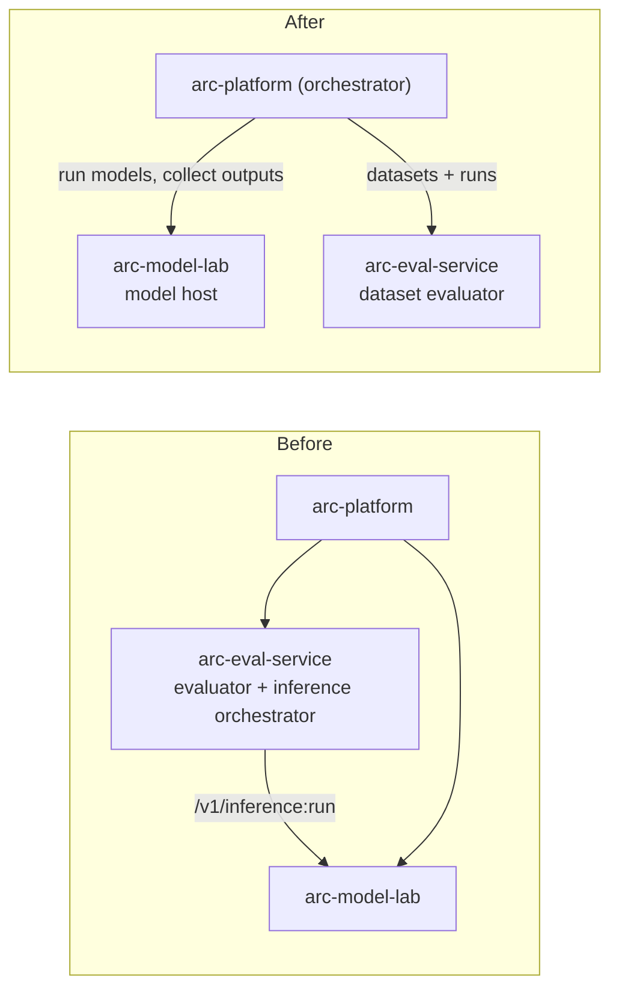
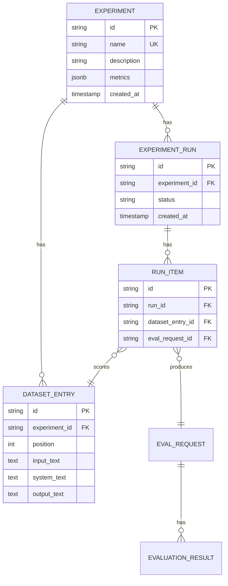
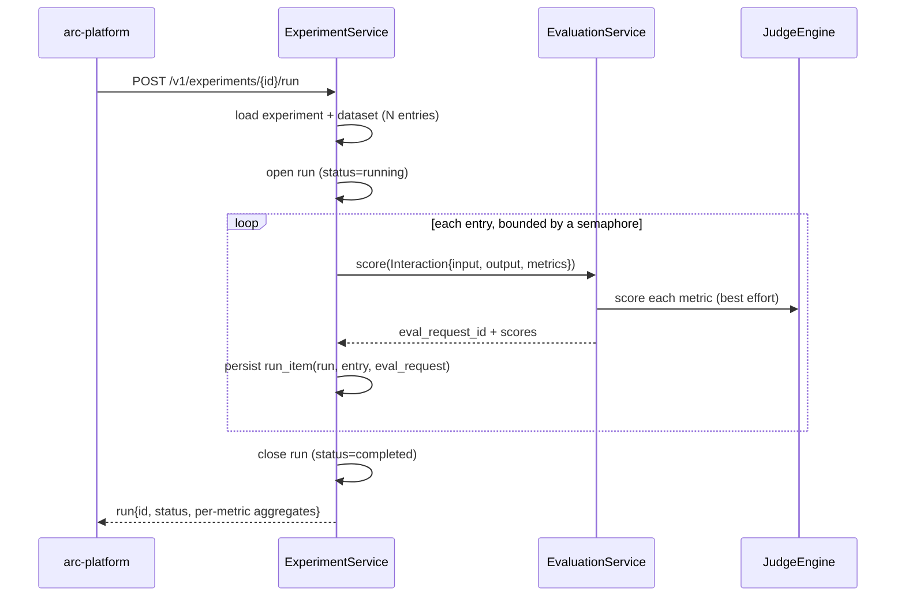
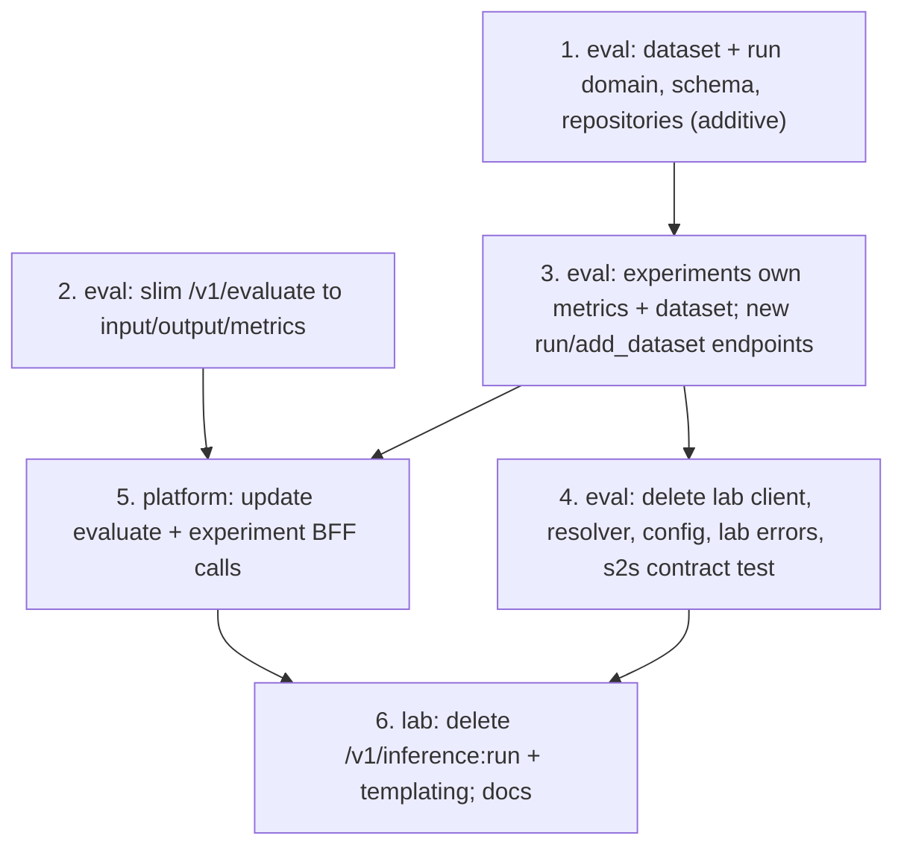

# Design: arc-eval-service as a dataset evaluator

Status: proposed. Audience: engineers on arc-eval-service, arc-model-lab, and
arc-platform. Reading time: 18 minutes.

This supersedes the earlier "remove prompt templating from the inference contract"
note. That change treated a symptom (the lab framing prompts). This one removes the
root cause: arc-eval-service generates nothing and depends on no other service. It
evaluates supplied interactions and datasets. The templating removal falls out of it.

## Summary

Three moves turn arc-eval-service into a pure evaluator:

1. **`POST /v1/evaluate` takes only `input_text`, `output_text`, and `metrics`.** The
   `prompt`, `inference_id`, and `metadata` fields go. Scoring already ignores
   `prompt` (the judge builds its case from input and output only), and the
   `inference_id` path was the only thing pulling the lab into the evaluate flow.
2. **An experiment owns its `metrics` and a `dataset`.** A dataset entry is
   `{input_text, system_text?, output_text}`, a completed interaction produced
   elsewhere. Experiments no longer carry a model, a generation config, or a prompt
   template.
3. **`POST /v1/experiments/{id}/run` scores the experiment's metrics over its
   dataset.** The old run (which called the lab to generate one inference, then
   scored it) is dropped. Datasets are added at create time or through a new
   `POST /v1/experiments/{id}/dataset` endpoint.

The consequence is the point: arc-eval-service stops calling arc-model-lab entirely.
Its lab client, the inference resolver, and the `ARC_LAB_SERVICE_URL` config are
deleted. The lab's `POST /v1/inference:run` loses its only consumer and is deleted
too. Each service ends with one job.



## Why

arc-eval-service today is two things: an evaluator and an inference orchestrator. Its
`ExperimentService.run` calls the lab to generate an inference, then scores it, so the
service owns an HTTP client, timeouts, a `503`-when-unconfigured failure mode, and a
resolver that fetches interactions from the lab by id. That coupling is the source of
the templating problem and of the awkward "evaluator that also runs models."

The dataset model removes it at the root. If an experiment evaluates outputs that were
produced elsewhere and handed in as data, arc-eval-service never generates, never
calls the lab, and never needs a model name or a generation config. The service does
exactly one thing: given text and metrics, produce scores.

Two facts make the evaluate slimming safe:

- **Scoring never reads `prompt`.** `build_case` maps an interaction onto the judging
  engine's `EvaluationCase` using `input`, `output`, and `context` (context is the
  input text, for grounded metrics). The `prompt` field was persisted for audit only.
  Dropping it changes no score.
- **No product caller uses the `inference_id` path or `metadata` today.** The
  arc-platform BFF calls `POST /v1/evaluate` with `{inference_id, metrics}` for its
  "evaluate a stored inference" surface. That surface changes: the platform already
  holds the inference (it ran it), so it sends `input_text` and `output_text` inline
  instead of a reference. One BFF call site updates; see the platform section.

## Principles applied

- **Single responsibility.** Lab hosts models. Eval scores interactions. Platform
  orchestrates. No service does two of these.
- **DRY.** A run reuses the exact scoring core `POST /v1/evaluate` uses, once per
  dataset entry. There is no second scoring path.
- **KISS.** A run scores a stored dataset. No inference, no generation config, no
  orchestration inside the evaluator.
- **YAGNI.** No model attribution on experiments, no background job queue, and no
  dataset versioning until a real need appears. Each is called out below with the
  condition that would justify it.
- **Make illegal states unrepresentable.** An experiment's `metrics` is non-empty and
  validated against the catalog at creation. A dataset entry always has `input_text`
  and `output_text`. A run cannot start against an empty dataset.

## Domain model



- **Experiment**: a named, reusable evaluation. Owns the metric set and the dataset.
- **DatasetEntry**: one completed interaction to score. `system_text` is optional and
  stored for fidelity; current metrics do not read it (see Decision 3).
- **ExperimentRun**: one execution of the experiment's metrics over its dataset. Its
  `status` supports a later move to background execution without an API change.
- **RunItem**: links one dataset entry, scored in one run, to the `eval_request` that
  holds its scores. This is what lets a run reuse the evaluate persistence and lets
  aggregation join back to `evaluation_results`.

The scoring core operates on an interaction value object, slimmed from today's
`ResolvedInteraction` (drop `prompt` and `metadata`, add optional `system_text`):

```python
@dataclass(frozen=True, slots=True)
class Interaction:
    input_text: str
    output_text: str
    metrics: tuple[str, ...]
    system_text: str | None = None
```

## Run flow

A run is a bounded fan-out over the dataset that reuses `EvaluationService.score`.



## Finalized contracts

Every request model uses `extra="forbid"`, so a removed field (or a typo) is a `422`,
not a silent ignore.

### `POST /v1/evaluate` (score one interaction)

Request:

```json
{
  "input_text": "The city council approved 20 miles of protected bike lanes.",
  "output_text": "The council approved 20 miles of protected bike lanes.",
  "metrics": ["faithfulness", "answer_relevance"]
}
```

- Removed vs today: `inference_id`, `prompt`, `metadata`.
- `metrics` is required (>= 1); an unknown metric name is a `404`.

Response (`200 OK`, unchanged shape):

```json
{
  "contract_version": "1.0.0",
  "results": [
    {
      "metric_name": "faithfulness",
      "score": 0.95,
      "reasoning": "Every claim in the output is supported by the input.",
      "evaluator_name": "faithfulness",
      "evaluator_version": "v1"
    }
  ]
}
```

### `POST /v1/experiments` (create, dataset optional)

Request:

```json
{
  "name": "qwen-summaries-v1",
  "description": "Summarization quality for Qwen 2.5 1.5B outputs.",
  "metrics": ["faithfulness", "answer_relevance"],
  "dataset": [
    {
      "input_text": "The city council approved 20 miles of protected bike lanes.",
      "output_text": "The council approved 20 miles of bike lanes."
    },
    {
      "input_text": "The museum extended its weekend hours for the summer.",
      "system_text": "You are a precise summarizer.",
      "output_text": "The museum has longer weekend hours this summer."
    }
  ]
}
```

- Removed vs today: `model_name`, `generation_config`, `prompt_template`, `variables`.
- `metrics` is required (>= 1), validated against the catalog at creation (unknown
  metric is a `404`). `name` is unique (`409` on a duplicate).
- `dataset` is optional; each entry requires `input_text` and `output_text`,
  `system_text` optional.

Response (`201 Created`):

```json
{
  "id": "3c4d5e6f-...",
  "name": "qwen-summaries-v1",
  "description": "Summarization quality for Qwen 2.5 1.5B outputs.",
  "metrics": ["faithfulness", "answer_relevance"],
  "dataset_size": 2,
  "created_at": "2026-07-14T00:00:00Z"
}
```

### `POST /v1/experiments/{id}/dataset` (add_dataset)

Request:

```json
{
  "entries": [
    {
      "input_text": "The library launched a free e-book lending program.",
      "output_text": "The library now lends e-books for free."
    }
  ]
}
```

Response (`201 Created`):

```json
{ "experiment_id": "3c4d5e6f-...", "added": 1, "dataset_size": 3 }
```

### `GET /v1/experiments/{id}/dataset` (list entries, bounded)

```json
[
  {
    "id": "d1-...",
    "position": 0,
    "input_text": "The city council approved 20 miles of protected bike lanes.",
    "system_text": null,
    "output_text": "The council approved 20 miles of bike lanes.",
    "created_at": "2026-07-14T00:00:00Z"
  }
]
```

### `POST /v1/experiments/{id}/run` (score the dataset)

Request: empty body. The metrics and the dataset come from the experiment.

Response (`201 Created`):

```json
{
  "run_id": "r1-...",
  "experiment_id": "3c4d5e6f-...",
  "status": "completed",
  "dataset_size": 3,
  "scored_count": 3,
  "results": [
    { "metric_name": "faithfulness", "average_score": 0.88, "evaluated_count": 3 },
    { "metric_name": "answer_relevance", "average_score": 0.91, "evaluated_count": 3 }
  ]
}
```

- `409` when the dataset is empty (nothing to score).
- A metric that errored on an entry (for example, no judge configured) is counted out
  of `evaluated_count` for that metric, never scored as a real zero.

### Reads (unchanged in spirit, adapted to runs)

- `GET /v1/experiments/{id}/results`: aggregated metric scores for the latest run.
- `GET /v1/experiments/{id}/runs` and `.../runs/{run_id}`: run history and one run's
  per-entry detail (observability).
- `GET /v1/experiments/{id}/compare/{other_id}`: compare two experiments' aggregates.
- `GET /v1/metrics`, `GET /v1/results`, `GET /v1/requests[/{id}]`: unchanged.

## Decision 1: run execution model

Synchronous with bounded concurrency now; a background seam for later.

| Option | Behavior | Cost | Verdict |
| --- | --- | --- | --- |
| A. Synchronous, bounded | Run scores the dataset inline, capped by a semaphore, returns the completed run | Simple, correct, one code path | Recommended now |
| B. Background job | Run returns `status=pending` immediately, a worker scores, client polls | A queue, a worker, status transitions | When a dataset or judge latency exceeds the request budget |

**Recommendation: A.** Research datasets are small and the judge calls already run
concurrently per interaction. Bound the fan-out with an `asyncio.Semaphore`
(`ARC_EVAL_RUN_CONCURRENCY`, a sane default like 8) so a large dataset cannot open
thousands of judge calls at once. Backpressure is mandatory here; an unbounded gather
over `N` entries times `M` metrics is an outage at scale.

The run resource carries a `status`, so option B is additive: the same endpoint later
returns `pending` and a worker fills the run, with no contract change. Do not build
the queue until a real dataset makes the synchronous path too slow for one request.

## Decision 2: model attribution

Drop it from arc-eval-service.

An experiment no longer names a model, and a dataset entry has no model field, so the
evaluator is model-agnostic. The `model_id` and `inference_id` correlation columns on
`eval_requests` and `evaluation_results`, and the `GET /v1/results?model_id=` filter,
lose their source for standalone evaluations. That attribution belongs to the
orchestrator that produced the outputs: arc-platform knows which model generated a
dataset and labels the experiment through its `name` and `description`.

Keep the columns nullable for now (they still serve older rows); drop them in a later
optional migration. If per-model rollups inside eval-service become a requirement, the
cheaper answer is an optional `model_label` on the experiment, not resurrecting the
lab coupling.

## Decision 3: `system_text` is stored, not yet scored

A dataset entry carries `system_text` because a faithful record of a completed
interaction includes the system prompt that produced it. No current metric
(`faithfulness`, `answer_relevance`, `safety`) reads it; they score `input` against
`output`. So store it, expose it on reads, and pass it on the `Interaction`, but do
not wire it into the judge case until a metric needs it. Wiring it in early would be a
speculative change to every metric template for no current scorer.

## Persistence and migrations

Two databases change, independently. arc-eval-service gains the dataset and run
tables; arc-model-lab gains one column on `inference`. Both are expressed
expand-then-contract so they are safe under load.

### arc-eval-service

**Expand**

- New table `experiment_dataset_entries`: `id` PK, `experiment_id` FK
  (`ON DELETE CASCADE`), `position` int, `input_text` text, `system_text` text null,
  `output_text` text, `created_at`. Index `experiment_id`.
- New table `experiment_run_items`: `id` PK, `run_id` FK (`ON DELETE CASCADE`),
  `dataset_entry_id` FK, `eval_request_id` FK (`ON DELETE SET NULL`), `created_at`.
  Index `run_id`.
- Add `experiments.metrics` jsonb, default `'[]'`.
- Add `experiment_runs.status` string, default `'completed'`; make
  `experiment_runs.inference_id` nullable (it is `NOT NULL UNIQUE` today).

**Contract** (a later migration, once no code writes the old columns)

- Drop `experiments.model_name`, `generation_config`, `prompt_template`, `variables`.
- Drop `experiment_runs.inference_id` and `eval_request_id` (superseded by
  `experiment_run_items`).
- Optionally slim `eval_requests`: drop `prompt`, `inference_id`, `model_id`,
  `request_metadata`; add `system_text` text null.

Both repositories are pre-release on `refact/exp` with no production data, so a single
replacing migration is acceptable here. The expand-then-contract split above is the
pattern to follow the moment real data exists, and it costs little to follow now.

Aggregation query for a run: `experiment_runs` to `experiment_run_items` to
`eval_requests` to `evaluation_results` by `eval_request_id`, grouped by
`metric_name`, averaging `score` where `error is null`. One indexed join path, no N+1.

### arc-model-lab: capture the decoding config on `inference`

Today an `inference` row records what went in and came out (`input_text`, `prompt`,
`output_text`, token counts, `latency_ms`) but not the decoding settings that produced
it, so the same input at `temperature` 0.0 and at 1.2 is indistinguishable after the
fact. Add a `generation_config` JSONB column so every row is self-describing and
reproducible.

```sql
ALTER TABLE inference
    ADD COLUMN generation_config jsonb NOT NULL DEFAULT '{}'::jsonb;
```

- **What it stores:** the resolved decoding config actually used, after server
  defaults are applied, not just what the caller sent. If `POST /inference` omits
  `temperature`, the row records the default that ran, so the row alone reproduces the
  call. Example: `{"temperature": 0.0, "max_output_tokens": 256}`.
- **Why JSONB, not columns:** decoding parameters are an open, per-call, evolving set
  that varies by runtime and model. A column per knob churns the schema on every new
  setting; JSONB absorbs `top_p`, `top_k`, `repetition_penalty`, or `seed` with no
  further migration, stays queryable (`generation_config ->> 'temperature'`), and is
  validated at the boundary by the `GenerationConfig` model, so the blob is a known
  shape, not a free-for-all. If the set were fixed at two knobs, columns would be
  simpler; it is not.
- **It complements the existing normalization.** The row already links how the model
  was built through `model_id` to the `models` catalog (`revision`, `adapter_path`,
  `tokenizer_id`). `generation_config` captures the other half, how it was decoded on
  this call. Model identity stays normalized (one row per model); decoding config is
  denormalized per inference, because it varies per call.

Migration `0007_inference_generation_config`, on top of the current head
`0006_drop_experiments_eval`:

- `ADD COLUMN ... DEFAULT '{}'::jsonb` is metadata-only in PostgreSQL 11+ (a constant
  default writes no existing rows), so it takes a brief lock and no table rewrite.
  Keep the `lock_timeout` and `statement_timeout` guards the other migrations set.
- No backfill: the config that produced historical rows is unknown, so they carry
  `{}` meaning "pre-capture." Every new row writes the resolved config.
- `downgrade()` drops the column.

Code: add `generation_config` to the `Inference` domain and the ORM row;
`InferenceService` records the resolved config when it builds the row; optionally
expose it on `InferenceResponse` (additive, lets the platform show the settings used).
Update `docs/database-erd.md` with the column, and drop that doc's stale mentions of
`/v1/inference:run` and eval-service reading inferences by id.

**arc-eval-service is unaffected by this column.** A dataset entry stores
`{input_text, system_text?, output_text}`, not how the output was decoded. If a
dataset must carry that provenance later, the config rides as an optional field on the
entry (the dataset-provenance open question), never by coupling the two databases.

## What the decoupling removes

### arc-eval-service

- `clients/lab_inference_client.py`: delete the whole module (client, request and
  result models, settings, factory).
- `services/interaction_resolver.py`: delete. The evaluate path builds the interaction
  inline; there is nothing to resolve.
- `services/evaluation_coordinator.py`: collapse. With no resolution, the route builds
  an `Interaction` from the request and calls `EvaluationService.score` directly.
- `api/dependencies.py`: remove `get_lab_inference_client` and
  `get_interaction_resolver`; `ExperimentService` no longer takes a `lab_client`.
- `core/config` and `.env`: remove `ARC_LAB_SERVICE_URL`, `ARC_LAB_TIMEOUT_SECONDS`;
  add `ARC_EVAL_RUN_CONCURRENCY`.
- `domain/errors.py` and `api/errors.py`: remove the lab errors (`LabInferenceError`,
  `LabNotConfiguredError`, `LabRequestInvalidError`, `InferenceNotFoundError`,
  `ModelInactiveError`, `ModelNotFoundError`) and their `502`/`503` handlers.
- `tests/contract/test_lab_inference_contract.py`: delete. There is no eval-to-lab
  contract anymore.
- `experiment_service.py`, `experiment_schemas.py`, `db/records.py`, repositories:
  reshape to the domain model above (metrics, dataset entries, run items).

### arc-model-lab

- `POST /v1/inference:run`, `InferenceService.run_named`, `allow_inactive`, the
  service-to-service `InferenceRunRequest`/`GenerationConfigSchema`, and
  `tests/contract/test_lab_inference_contract.py`: delete. Its only caller was
  arc-eval-service; the platform uses `POST /inference`.
- Prompt templating on the surviving `POST /inference`: still removed, as in the
  earlier note. The platform sends `{model_name, input_text, temperature?}` only.
- The lab ends with `POST /inference`, `GET /inference[/{id}]`, and `/models`.
- Additive, not a removal: the surviving `inference` table gains a `generation_config`
  JSONB column that records the decoding settings each row was produced with. See
  Persistence and migrations.

### arc-platform

- `server/eval-service/client.ts`: `evaluateInference(id, metrics)` changes from
  sending `{inference_id, metrics}` to sending `{input_text, output_text, metrics}`
  from the inference the caller already holds. `createExperiment` gains `metrics` (and
  optionally a `dataset`); a new `addDataset` and `runExperiment` (no `input_text`)
  follow the contracts above.
- `docs/arc-platform.md`: correct the stale line attributing evaluation and
  experiments to arc-model-lab.

## Failure modes and reliability

- **Empty dataset run.** `409`, no run row created. A run must have something to score.
- **A judge fails on some entries.** The engine already degrades a failed metric to an
  errored result rather than raising, so a run completes with those metric-entries
  omitted from the average. The run status is `completed`; per-item errors are visible
  through `.../runs/{run_id}`.
- **Process dies mid-run.** Run items are written as each entry finishes, so a
  resumed design can skip completed entries. For the synchronous MVP a crashed run is
  left `running` and simply re-run; nothing is double-counted because aggregation is
  per run.
- **Unbounded fan-out.** Prevented by the concurrency semaphore. This is the one
  scale-critical control in the design.
- **add_dataset idempotency.** Appends by default; a client that retries adds
  duplicates. Acceptable now (a dataset may legitimately repeat an entry). Add an
  idempotency key only if a caller needs exactly-once appends.

## Observability

- Structured logs at run start and end with `experiment_id`, `run_id`, `dataset_size`,
  `scored_count`, and duration. Per-entry scoring already logs metric failures.
- Metrics: rate, error, and duration on the run operation and on the judge boundary.
- A correlation id per run threads through every `score` call so one run's judge calls
  are greppable together.

## Dependencies and ordering

Decomposed into independently reviewable, deployable PRs. The eval-service internal
work comes first; the cross-service contract changes are sequenced expand-then-contract
so no deploy order breaks a caller.



- **PR 1** is additive: the new tables and domain, no behavior change.
- **PR 2 and PR 3** land the new eval contracts. **PR 5** updates the platform to
  match, and must deploy before or with them for the evaluate and experiment surfaces.
- **PR 4** removes the lab client once the run path no longer generates. **PR 6**
  deletes the lab's now-dead `/v1/inference:run` after the platform and eval no longer
  call it. Deleting it earlier would `404` an in-flight eval run, so it goes last.
- Paired contract tests move with each cross-service step; the eval-to-lab pair is
  deleted in PR 4, not edited.

## Open questions

- **Dataset provenance.** Should a dataset entry optionally record where its output
  came from (a `source_inference_id`, `model_label`)? Useful for tracing a bad score
  back to a model, but not required to score. Add only when a caller needs the trace.
- **Dataset size limits.** A hard cap on entries per experiment and per `add_dataset`
  call bounds a run's cost. Recommend a configured maximum before the first large
  dataset arrives, defaulting generous.
- **Reusable datasets.** Datasets are owned by one experiment here. If the same
  dataset must feed several experiments, promote it to a first-class resource
  (`/v1/datasets`) that experiments reference. Deferred under YAGNI until a second
  experiment needs the same data.
