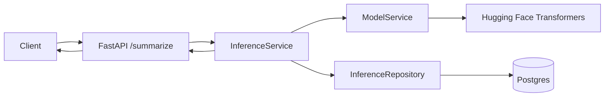
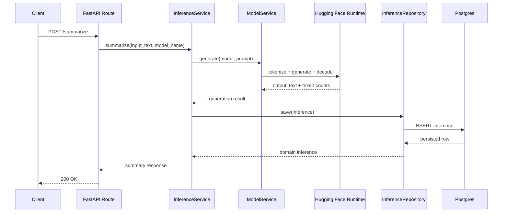
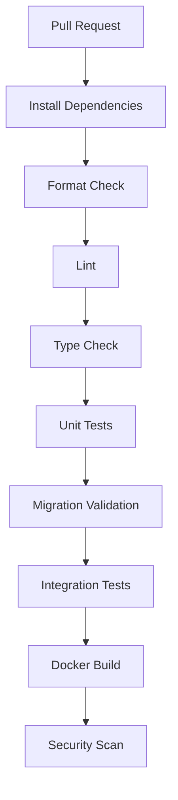

# 00 - Initial Slice

## Purpose

`arc-model-lab` is the foundational model experimentation service for the ARC platform.

Its first responsibility is intentionally narrow:

> Accept text, run local model inference, persist the inference record, and return the generated result.

Every future capability depends on this slice. Evaluation needs inference records. Experiments need grouped inference records. Datasets need inference and evaluation history. Training needs datasets. A model registry needs trained artifacts. OpenTelemetry needs a stable request lifecycle to instrument.

The Initial Slice should therefore be small, durable, and correct.

## Design Principles

### Simplicity

The service starts with the smallest useful production shape. It should not include a provider abstraction, workflow engine, event bus, queue, plugin framework, or distributed training system.

### Domain-first modeling

The first two domain concepts are:

- `Model`
- `Inference`

These names intentionally match the business language of the system.

A `Model` is something the service can load and run.

An `Inference` is one execution of a model against a prompt.

### Orthogonal ownership

Each module owns one concern:

| Module | Responsibility |
|---|---|
| `api/` | HTTP request/response surface |
| `domain/` | Business entities and domain exceptions |
| `services/` | Business workflows |
| `db/` | Persistence models, sessions, and repositories |
| `config.py` | Runtime configuration |
| `main.py` | Application startup |

### Progressive architecture

Abstractions are introduced only after real usage proves they are needed.

Deferred concepts:

- Evaluation result
- Experiment
- Dataset
- Prompt version
- Training run
- Model registry
- OpenTelemetry instrumentation
- Provider abstraction
- Async job queue

## Goals

- Create a FastAPI service with one endpoint: `POST /summarize`.
- Load a Hugging Face model and tokenizer.
- Generate a summary for user-provided text.
- Persist every inference in Postgres before returning the response.
- Keep the codebase small and easy for another engineer to understand.
- Establish CI/CD, Make targets, and test structure from day one.

## Non-goals

- Fine-tuning
- Evaluation
- Experiment tracking
- Dataset management
- Prompt registry
- Multi-provider inference
- Async inference
- Streaming responses
- OTel tracing
- Production autoscaling policy

## Repository Layout

```text
arc-model-lab/
├── pyproject.toml
├── uv.lock
├── README.md
├── Makefile
├── Dockerfile
├── compose.yaml
├── alembic.ini
├── migrations/
├── tests/
│   ├── unit/
│   ├── integration/
│   └── api/
│
└── src/
    └── arc_model_lab/
        ├── api/
        │   ├── routes/
        │   │   └── summarize.py
        │   ├── schemas/
        │   │   └── summarize.py
        │   └── dependencies.py
        │
        ├── domain/
        │   ├── model.py
        │   ├── inference.py
        │   ├── enums.py
        │   └── exceptions.py
        │
        ├── services/
        │   ├── inference_service.py
        │   └── model_service.py
        │
        ├── db/
        │   ├── models/
        │   │   ├── model.py
        │   │   └── inference.py
        │   ├── repositories/
        │   │   ├── model_repository.py
        │   │   └── inference_repository.py
        │   ├── base.py
        │   └── session.py
        │
        ├── config.py
        └── main.py
```

## System Architecture



## Domain Model

### Model

`Model` represents a loadable inference model.

It is not responsible for loading weights. It does not contain Hugging Face runtime objects. It does not know about SQLAlchemy.

```python
@dataclass(frozen=True, slots=True)
class Model:
    id: UUID
    name: str
    provider: str
    model_id: str
    tokenizer_id: str
    adapter_path: str | None
    created_at: datetime
```

Field rationale:

| Field | Rationale |
|---|---|
| `id` | Stable internal reference |
| `name` | Human-readable service name |
| `provider` | Initially `huggingface`; later useful for registry |
| `model_id` | Hugging Face model identifier |
| `tokenizer_id` | Tokenizer identifier; usually same as model |
| `adapter_path` | Optional future LoRA adapter path |
| `created_at` | Auditability |

### Inference

`Inference` represents one execution of a model.

It is the most important record in the system because it becomes the source for future evaluation, dataset extraction, debugging, and regression analysis.

```python
@dataclass(frozen=True, slots=True)
class Inference:
    id: UUID
    model_id: UUID
    input_text: str
    prompt: str
    output_text: str
    latency_ms: int
    prompt_tokens: int | None
    completion_tokens: int | None
    created_at: datetime
```

Field rationale:

| Field | Rationale |
|---|---|
| `model_id` | Connects output to model configuration |
| `input_text` | Original user payload |
| `prompt` | Rendered prompt sent to model |
| `output_text` | Raw generated model output |
| `latency_ms` | Basic operational performance signal |
| `prompt_tokens` | Cost and context tracking |
| `completion_tokens` | Output size tracking |

## Database Design

### Table: models

```sql
CREATE TABLE models (
    id UUID PRIMARY KEY,
    name TEXT NOT NULL,
    provider TEXT NOT NULL,
    model_id TEXT NOT NULL,
    tokenizer_id TEXT NOT NULL,
    adapter_path TEXT,
    created_at TIMESTAMPTZ NOT NULL DEFAULT now()
);
```

Recommended indexes:

```sql
CREATE UNIQUE INDEX uq_models_name ON models(name);
CREATE INDEX ix_models_provider ON models(provider);
```

### Table: inference

```sql
CREATE TABLE inference (
    id UUID PRIMARY KEY,
    model_id UUID NOT NULL REFERENCES models(id),

    input_text TEXT NOT NULL,
    prompt TEXT NOT NULL,
    output_text TEXT NOT NULL,

    latency_ms INTEGER NOT NULL,
    prompt_tokens INTEGER,
    completion_tokens INTEGER,

    created_at TIMESTAMPTZ NOT NULL DEFAULT now()
);
```

Recommended indexes:

```sql
CREATE INDEX ix_inference_model_id ON inference(model_id);
CREATE INDEX ix_inference_created_at ON inference(created_at);
```

## Service Responsibilities

### ModelService

Owns:

- loading tokenizer
- loading model
- caching model runtime objects in process
- generating text from a prompt
- counting tokens where available

Does not own:

- HTTP concerns
- database writes
- prompt policy
- evaluation
- training

### InferenceService

Owns:

- summarization workflow
- prompt construction
- calling `ModelService`
- latency measurement
- creating the domain `Inference`
- persisting inference through repository
- returning response DTO to API layer

Does not own:

- Hugging Face internals
- SQLAlchemy models
- API schema validation
- eval calls

### Repositories

Repositories own database persistence and mapping between DB models and domain entities.

Repositories should not contain business workflows.

## Request Lifecycle



## Error Handling

Initial slice should keep error handling explicit.

| Failure | Handling |
|---|---|
| Model not found | 404 or 400 depending on API semantics |
| Model load failure | 503 service unavailable |
| Generation failure | 500 with safe message |
| DB write failure | request fails; do not return unpersisted result |
| Input too large | 413 or 422 |
| Empty input | 422 |

The persistence requirement is strict:

> The service must not return a successful inference response unless the inference record has been persisted.

## Configuration

Use a single `config.py` file.

Example settings:

```python
class Settings(BaseSettings):
    app_name: str = "arc-model-lab"
    environment: str = "local"

    database_url: str

    default_model_name: str = "qwen-1.5b"
    default_model_id: str = "Qwen/Qwen2.5-1.5B-Instruct"
    default_tokenizer_id: str = "Qwen/Qwen2.5-1.5B-Instruct"

    max_new_tokens: int = 256
    temperature: float = 0.2
    model_cache_dir: str | None = None
```

## Testing Strategy

### Unit tests

Cover:

- prompt construction
- domain model validation helpers
- model service behavior with mocked runtime
- inference service orchestration

### Repository tests

Cover:

- inserting a model
- retrieving a model by name
- inserting inference
- foreign key behavior

### API tests

Cover:

- valid summarize request
- empty input
- unknown model
- generation failure
- DB failure

### Integration test

One smoke test should exercise:

```text
API -> service -> repository -> Postgres
```

For local CPU development, do not require the real Hugging Face model in every test. Use a fake model runtime for CI.

## CI/CD Evolution

### Pull request pipeline



### Initial GitHub Actions jobs

- `quality`
- `tests`
- `migrations`
- `docker-build`
- `security`

CI should not download large model weights by default. The model runtime should be mockable.

## Security Considerations

- Do not log full input text at application log level.
- Store inference payloads only in the database.
- Use environment variables for DB credentials.
- Do not commit model artifacts.
- Do not commit `.env`.
- Add `.gitignore` for local model cache directories.
- Validate maximum input size.

## Definition of Done

The Initial Slice is complete when:

- `POST /summarize` returns model output.
- Every successful response corresponds to a row in `inference`.
- `models` table has at least one seed model.
- Alembic migrations are committed.
- Local development works through Make targets.
- Unit, repository, integration, and API tests pass.
- CI pipeline runs on every PR.
- Docker image builds successfully.
- README explains how to run locally.
- No provider abstraction, event bus, or experiment abstraction exists yet.

## Future Evolution

The next phase introduces Evaluation.

Evaluation should be added only after inference persistence is stable because evaluation depends on durable inference records.

The next architectural capability is:

```text
Generate output -> Persist inference -> Evaluate output -> Persist score
```

This creates the first closed feedback loop in the system.
