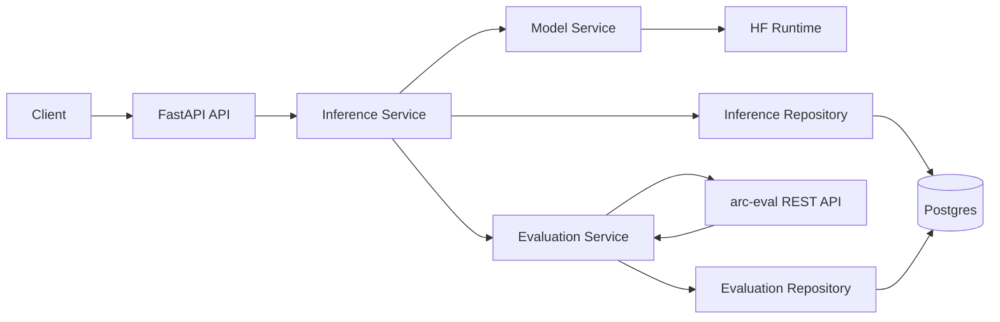
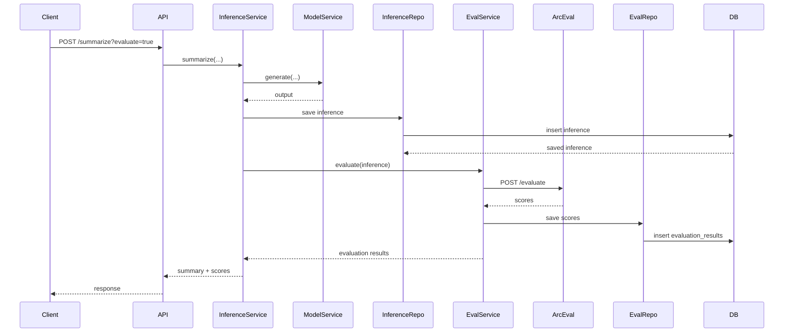
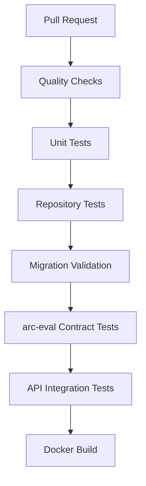

# 01 - Evaluation Integration

## Purpose

The Evaluation phase connects `arc-model-lab` to the existing `arc-eval` service through a REST API boundary.

The Initial Slice produces durable inference records. Evaluation turns those records into quality signals.

The system evolves from:

```text
Model -> Inference
```

to:

```text
Model -> Inference -> EvaluationResult
```

This is the first step toward a closed-loop model improvement platform.

## Why This Phase Comes Next

Evaluation must come before experiments, datasets, and training because all of those capabilities depend on quality signals.

Without evaluation:

- experiments are just grouped logs
- datasets cannot be filtered by quality
- training data has no correctness signal
- model comparison is subjective
- prompt changes cannot be measured

Evaluation converts inference records into measurable artifacts.

## Goals

- Add `EvaluationResult` as a new domain concept.
- Call `arc-eval` after inference.
- Persist evaluation results linked to inference IDs.
- Keep evaluation decoupled from model generation.
- Add API support for optional evaluation on summarize requests.
- Add replay/backfill commands for historical inference records.
- Extend CI/CD with eval contract tests.

## Non-goals

- Building a new evaluator inside `arc-model-lab`
- Replacing `arc-eval`
- Async event-driven evaluation
- Distributed backfill system
- Complex eval orchestration
- Human review workflows

## Architectural Decision

Evaluation remains a separate service boundary.

`arc-model-lab` owns:

- model execution
- inference storage
- calling eval
- storing eval result references

`arc-eval` owns:

- scoring logic
- metrics
- rubric execution
- judge model behavior

This prevents `arc-model-lab` from becoming a dumping ground for evaluation logic.

## Repository Evolution

```text
src/arc_model_lab/
├── api/
│   ├── routes/
│   │   ├── summarize.py
│   │   └── evaluations.py
│   └── schemas/
│       ├── summarize.py
│       └── evaluations.py
│
├── domain/
│   ├── model.py
│   ├── inference.py
│   ├── evaluation.py
│   ├── enums.py
│   └── exceptions.py
│
├── services/
│   ├── inference_service.py
│   ├── model_service.py
│   └── evaluation_service.py
│
├── db/
│   ├── models/
│   │   ├── model.py
│   │   ├── inference.py
│   │   └── evaluation.py
│   └── repositories/
│       ├── model_repository.py
│       ├── inference_repository.py
│       └── evaluation_repository.py
│
├── config.py
└── main.py
```

## System Architecture



## Domain Model

### EvaluationResult

`EvaluationResult` represents one metric score for one inference.

```python
@dataclass(frozen=True, slots=True)
class EvaluationResult:
    id: UUID
    inference_id: UUID
    metric_name: str
    score: float
    reasoning: str | None
    evaluator_name: str
    evaluator_version: str | None
    created_at: datetime
```

### Why metric-per-row

Store one metric per row rather than one JSON blob.

This makes it easier to:

- query by metric
- compare models
- index scores
- compute aggregates
- backfill one metric without rewriting others

A JSON payload can still exist as `metadata` later, but relational columns should capture the primary query path.

## Database Design

```sql
CREATE TABLE evaluation_results (
    id UUID PRIMARY KEY,
    inference_id UUID NOT NULL REFERENCES inference(id),

    metric_name TEXT NOT NULL,
    score DOUBLE PRECISION NOT NULL,
    reasoning TEXT,

    evaluator_name TEXT NOT NULL,
    evaluator_version TEXT,

    created_at TIMESTAMPTZ NOT NULL DEFAULT now()
);
```

Recommended indexes:

```sql
CREATE INDEX ix_evaluation_results_inference_id
    ON evaluation_results(inference_id);

CREATE INDEX ix_evaluation_results_metric_name
    ON evaluation_results(metric_name);

CREATE INDEX ix_evaluation_results_created_at
    ON evaluation_results(created_at);

CREATE UNIQUE INDEX uq_evaluation_inference_metric_evaluator
    ON evaluation_results(inference_id, metric_name, evaluator_name);
```

## REST Contract with arc-eval

`arc-model-lab` sends:

```json
{
  "task_type": "summarization",
  "input_text": "original input",
  "output_text": "model output",
  "prompt": "rendered prompt",
  "metadata": {
    "inference_id": "uuid",
    "model_id": "uuid"
  }
}
```

`arc-eval` returns:

```json
{
  "results": [
    {
      "metric_name": "faithfulness",
      "score": 0.91,
      "reasoning": "The summary is grounded in the source text.",
      "evaluator_name": "summary-faithfulness",
      "evaluator_version": "v1"
    }
  ]
}
```

## Request Lifecycle



## Failure Handling

Evaluation failures should not corrupt inference storage.

Initial policy:

| Failure | Behavior |
|---|---|
| Inference fails | no eval call |
| Inference save fails | request fails |
| Eval service unavailable | return inference result with `evaluation_status=failed` if caller allows fail-open |
| Eval response invalid | store no result; return warning |
| Duplicate eval metric | upsert or ignore based on repository policy |

Recommended default:

- Inference persistence is fail-closed.
- Evaluation is fail-open for online requests.
- Evaluation backfills are fail-closed per job item but continue processing other rows.

## API Changes

The summarize response can include evaluation metadata only when requested.

Request:

```json
{
  "text": "long article",
  "model_name": "qwen-1.5b",
  "evaluate": true
}
```

Response:

```json
{
  "inference_id": "uuid",
  "model_id": "uuid",
  "output_text": "summary",
  "latency_ms": 1234,
  "evaluation": {
    "status": "completed",
    "results": [
      {
        "metric_name": "faithfulness",
        "score": 0.91
      }
    ]
  }
}
```

## Make Targets

```make
make eval.run          # evaluate a single inference by id
make eval.replay       # replay unevaluated inference rows
make eval.backfill     # backfill evaluations over a time range
make eval.contract     # run contract tests against mocked arc-eval
make eval.smoke        # run local end-to-end eval smoke test
```

## CI/CD Evolution

Add jobs:

```text
eval-contract-tests
eval-service-mock-tests
eval-schema-validation
```

PR pipeline now becomes:



Do not require a live `arc-eval` deployment in PR CI. Use a mock server or contract fixture.

Merge pipeline adds:

```text
deploy dev
  -> run summarize smoke test
  -> run eval smoke test
  -> verify evaluation row exists
```

## Testing Strategy

### Unit tests

- evaluation service request building
- response parsing
- invalid response handling
- fail-open behavior
- fail-closed behavior

### Contract tests

- request body matches `arc-eval` expected schema
- response body parsing remains compatible
- required fields are validated

### Integration tests

- inference persisted
- eval called
- evaluation rows persisted
- response includes evaluation status

## Operational Considerations

Metrics to track through database initially:

- percentage of inferences evaluated
- average score per metric
- evaluation failure rate
- evaluation latency
- unevaluated inference backlog

These can be computed from SQL before OpenTelemetry exists.

## Definition of Done

- `evaluation_results` table exists.
- `EvaluationResult` domain entity exists.
- `EvaluationService` can call `arc-eval`.
- Eval results persist by inference ID.
- Summarize endpoint supports optional evaluation.
- Backfill command can evaluate historical inference records.
- CI includes eval contract tests.
- Make targets exist for local eval workflows.
- README documents how to run local eval integration.

## Future Evolution

The next phase introduces Experiments.

Experiments need evaluation results because the purpose of an experiment is comparison. Without scores, an experiment is only a label. After this phase, the system can compare outputs quantitatively.
