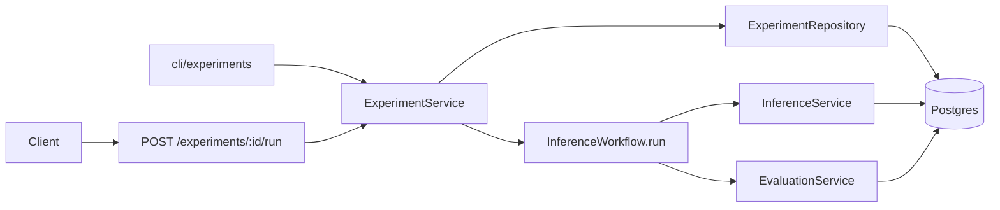
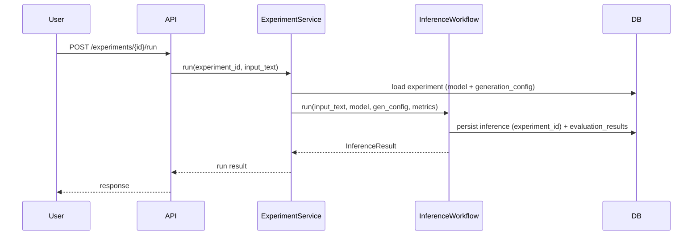

# 02 - Experiments

> Current state: implemented in the main service slice. Experiments are persisted,
> runnable, and queryable through API and CLI, and runs are tagged via
> `inference.experiment_id`. `/inference` still uses the deployed model path.

## Purpose

The Experiments phase introduces a lightweight grouping mechanism for comparable inference and evaluation runs.

An experiment answers:

> What configuration produced these outputs and scores?

The system evolves from:

```text
Model -> Inference -> EvaluationResult
```

to:

```text
Experiment -> Model -> Inference -> EvaluationResult
```

An experiment is a durable, server-side run configuration (a model plus generation parameters, and later a prompt version) together with the inference and evaluation records it produced. It is not a generic ML platform abstraction, and it does not reintroduce caller-chosen models: `/inference` stays deployed-model only, and an experiment is an engineer-owned construct that runs its own configuration.

## Why This Phase Comes After Evaluation

Experiments require measurable outcomes.

If experiments are introduced before evaluation, they become folders for logs. After evaluation exists, experiments can answer useful questions:

- Which base model performed better?
- Did a prompt change improve faithfulness? (once phase 03 exists)
- Did more beams (`num_beams`) change summary quality?
- Did a new adapter regress coverage?

## Goals

- Add `Experiment` as a domain entity (append to `domain/__init__.py`).
- Associate inference records with experiments (`inference.experiment_id`, nullable).
- Capture the model and deterministic generation config for reproducibility.
- Run experiments by composing the existing `InferenceWorkflow`, not a parallel path.
- Provide an API, a CLI, and SQL-based comparison.
- Preserve the deployed-model `/inference` path unchanged.

## Non-goals

- Full MLflow replacement
- Hyperparameter search
- Distributed or async experiment runner (stay sync; the async seam is `InferenceWorkflow`)
- Automated model promotion
- Sampling/temperature knobs (decoding is deterministic today; adding sampling is a separate prerequisite)
- Dataset management, training orchestration

## Repository Evolution

The codebase uses single-file `db/models.py`, `db/repositories.py`, and `domain/__init__.py`, so this phase appends types rather than adding per-entity directories.

```text
src/arc_model_lab/
├── api/
│   ├── routes/experiments.py        # new
│   └── schemas/experiments.py       # new
├── domain/__init__.py               # + Experiment, ExperimentStatus
├── services/
│   ├── experiment_service.py        # new: composes InferenceWorkflow
│   ├── inference_workflow.py        # unchanged seam, reused
│   └── model_service.py             # generate() gains per-run gen params
├── db/
│   ├── models.py                    # + ExperimentRecord
│   └── repositories.py              # + ExperimentRepository
└── cli/experiments.py               # new: create / run / compare
```

## System Architecture



## Domain Model

### Experiment

```python
@dataclass(frozen=True, slots=True)
class Experiment:
    id: UUID
    name: str
    description: str | None
    model_id: UUID
    prompt_version_id: UUID | None   # deferred to phase 03; keep nullable now
    generation_config: dict[str, Any]
    created_by: str | None
    created_at: datetime
```

Field rationale:

| Field | Rationale |
|---|---|
| `name` | Human-readable experiment label |
| `model_id` | Catalog model under test (FK to `models.id`) |
| `prompt_version_id` | Null until phase 03; naming it now avoids a rename later |
| `generation_config` | Deterministic knobs only: `num_beams`, `max_new_tokens`, `max_input_tokens` |
| `created_by` | Auditability |
| `created_at` | Time-based filtering |

`generation_config` is validated against the parameters `ModelService.generate` actually accepts, so an experiment cannot request a knob the runtime ignores.

## Database Changes

One Alembic migration, autogenerated from the new models. Keep the metadata naming convention so constraint names stay stable.

```sql
CREATE TABLE experiments (
    id UUID PRIMARY KEY,
    name TEXT NOT NULL,
    description TEXT,
    model_id UUID NOT NULL REFERENCES models(id),
    prompt_version_id UUID,
    generation_config JSONB NOT NULL DEFAULT '{}'::jsonb,
    created_by TEXT,
    created_at TIMESTAMPTZ NOT NULL DEFAULT now()
);

ALTER TABLE inference
ADD COLUMN experiment_id UUID REFERENCES experiments(id) ON DELETE SET NULL;
```

Indexes:

```sql
CREATE UNIQUE INDEX uq_experiments_name ON experiments(name);
CREATE INDEX ix_experiments_model_id ON experiments(model_id);
CREATE INDEX ix_inference_experiment_id ON inference(experiment_id);
```

`inference.experiment_id` is nullable so the deployed-model `/inference` path keeps writing rows with no experiment. `ON DELETE SET NULL` preserves inference history if an experiment is removed.

## Request Lifecycle



`ExperimentService` loads the experiment and tags the run; `InferenceWorkflow` still owns generate-then-score. The only change the seam needs is to accept an explicit model and generation config, with the deployed-model default preserved for `/inference`.

## API Surface

Initial endpoints:

```text
POST /experiments
GET  /experiments/{experiment_id}
POST /experiments/{experiment_id}/run
GET  /experiments/{experiment_id}/results
GET  /experiments/{experiment_id}/compare
```

Create request (deterministic knobs only, no temperature):

```json
{
  "name": "qwen-baseline-greedy",
  "description": "Baseline summarization with the deployed base model, greedy decoding",
  "model_id": "uuid",
  "generation_config": {
    "num_beams": 1,
    "max_new_tokens": 256,
    "max_input_tokens": 1024
  }
}
```

## Service Responsibilities

### ExperimentService

Owns:

- creating experiments
- validating `generation_config` against runtime-supported knobs
- running an experiment by calling `InferenceWorkflow.run` with the experiment's model and config
- retrieving and comparing results (SQL aggregation)

Does not own:

- model loading or generation (that is `ModelService`)
- the generate-then-score sequence (that is `InferenceWorkflow`)
- scoring logic (that is arc-eval)

### The one enabling change

Today `ModelService.generate` reads generation parameters from global `Settings`, and `InferenceService.summarize(session, input_text)` resolves the deployed model. To run experiments without duplicating orchestration:

- `ModelService.generate` takes explicit generation params (defaulting to `Settings`).
- `InferenceWorkflow.run` accepts an optional model and generation config; when omitted it uses the deployed model, so `/inference` is unchanged.

This keeps one orchestration path (DRY) and one owner of decoding (SOLID).

## Comparison Logic

Initial comparison can be simple SQL aggregation.

Example query:

```sql
SELECT
    e.name,
    er.metric_name,
    AVG(er.score) AS avg_score,
    COUNT(*) AS evaluated_count
FROM experiments e
JOIN inference i ON i.experiment_id = e.id
JOIN evaluation_results er ON er.inference_id = i.id
GROUP BY e.name, er.metric_name;
```

## Make Targets

Follow the existing `<area>.<verb>` convention (like `model.*` and `eval.*`); see the Makefile appendix. Minimum set:

```make
make exp.create     # create an experiment from a fixture
make exp.run        # run an experiment against sample input
make exp.compare    # compare two experiments (SQL aggregation)
make exp.smoke      # create -> run -> evaluate -> assert aggregate exists
```

## CI/CD

No new pipeline shape. The base PR pipeline (format, lint, mypy, unit, migration check, integration, docker) already covers this phase; the migration adds the up/down check for `experiments` and `inference.experiment_id`. Keep `arc-eval` mocked in PR CI. See the CI/CD appendix.

## Testing Strategy

### Unit tests

- experiment creation validation
- generation config validation
- comparison calculation
- missing experiment behavior

### Integration tests

- create experiment
- run experiment
- inference row gets experiment ID
- evaluation links to inference
- results endpoint aggregates scores

### Migration tests

- existing inference rows still valid with nullable `experiment_id`
- new inference rows can be linked to experiments

## Operational Considerations

Experiments can create many inference rows. Add keyset pagination (not OFFSET) to result endpoints early.

Do not store result payloads on the experiment row. Experiments reference outputs through inference rows, which already hold the prompt, output, tokens, and latency.

## Definition of Done

- `experiments` table and nullable `inference.experiment_id` exist (one migration, up and down verified).
- `Experiment` and `ExperimentRepository` are added to the single-file modules.
- Experiment runs go through `InferenceWorkflow`, not a parallel path.
- API supports create, run, results, and compare.
- Results aggregate evaluation scores by metric via SQL.
- `generation_config` is validated against runtime-supported knobs.
- The deployed-model `/inference` path still works with no experiment.

## Future Evolution

The next phase introduces Prompt Management. Experiments capture the model and generation config, but the prompt is still code-owned (`build_summary_messages` in `inference_workflow.py`). Phase 03 makes the prompt an explicit, versioned, pinnable input so an experiment can vary it too.
