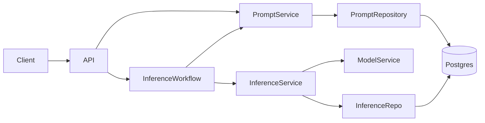
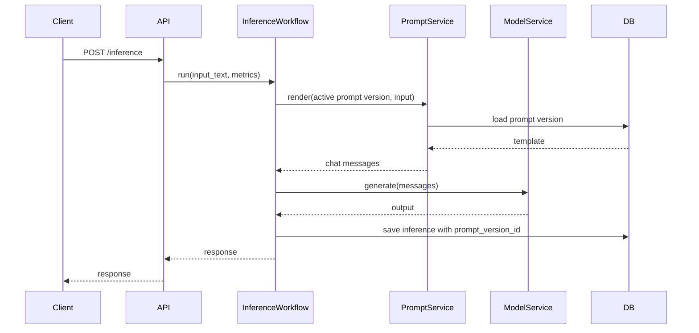

# 03 - Prompt Management

> Current state: not started. The summarization prompt is hardcoded in
> `inference_workflow.py` (`build_summary_messages`, `_SUMMARY_SYSTEM_PROMPT`,
> `_SUMMARY_INSTRUCTION`), and the rendered prompt is already persisted in
> `inference.prompt`. arc-eval already versions its metric and judge prompts as a
> validated catalog; this phase brings the same idea to arc-model-lab.

## Purpose

Prompt Management introduces durable prompt templates and prompt versions.

Today the prompt lives in code (`build_summary_messages`). That is fine for the initial slices, but it becomes limiting once experiments exist: prompt changes in code only are hard to reproduce, pin, or compare against prior outputs.

This phase makes prompts a first-class, versioned input.

The system evolves from:

```text
Experiment -> Model -> Inference -> EvaluationResult
```

to:

```text
Experiment -> Prompt -> Model -> Inference -> EvaluationResult
```

## Why Prompt Management Comes Before Datasets

Datasets generated from inference logs are only meaningful if the prompt that produced the output is known.

If prompt lineage is missing, a dataset row cannot answer:

- Which instruction produced this summary?
- Did the model fail, or did the prompt ask the wrong thing?
- Is this output reusable for training?
- Can this inference be reproduced?

Prompt management preserves that lineage.

## Goals

- Add prompt templates and prompt versions (append types to the single-file modules).
- Render into the chat messages the tokenizer expects (system + user), replacing `build_summary_messages`.
- Link inference records to the prompt version used (`inference.prompt_version_id`).
- Let experiments pin a prompt version (the `prompt_version_id` reserved in phase 02).
- Support activation and rollback.

## Non-goals

- Full prompt IDE
- Human approval workflow
- Dynamic prompt optimization
- Prompt marketplace
- Multi-modal prompt support
- A templating engine (use `str.format`/`string.Template`; no Jinja until conditionals are truly needed)

## Repository Evolution

```text
src/arc_model_lab/
├── domain/__init__.py           # + Prompt, PromptVersion
├── services/
│   ├── prompt_service.py        # new: create/version/activate/render
│   └── inference_workflow.py    # build_summary_messages -> PromptService.render
├── db/
│   ├── models.py                # + PromptRecord, PromptVersionRecord
│   └── repositories.py          # + PromptRepository
├── api/
│   ├── routes/prompts.py        # new
│   └── schemas/prompts.py       # new
└── cli/prompts.py               # new: create / version / activate / render
```

## System Architecture



## Domain Model

### Prompt

```python
@dataclass(frozen=True, slots=True)
class Prompt:
    id: UUID
    name: str
    description: str | None
    created_at: datetime
```

### PromptVersion

```python
@dataclass(frozen=True, slots=True)
class PromptVersion:
    id: UUID
    prompt_id: UUID
    version: int
    template: str
    input_variables: list[str]
    is_active: bool
    created_by: str | None
    created_at: datetime
```

A prompt can have many versions. Exactly one version is active for default use; an experiment can pin any version. `template` holds the user-message template; rendering produces the chat messages (system + user) that the tokenizer's chat template expects, matching today's `build_summary_messages`.

## Database Design

```sql
CREATE TABLE prompts (
    id UUID PRIMARY KEY,
    name TEXT NOT NULL,
    description TEXT,
    created_at TIMESTAMPTZ NOT NULL DEFAULT now()
);

CREATE TABLE prompt_versions (
    id UUID PRIMARY KEY,
    prompt_id UUID NOT NULL REFERENCES prompts(id),
    version INTEGER NOT NULL,
    template TEXT NOT NULL,
    input_variables JSONB NOT NULL DEFAULT '[]'::jsonb,
    is_active BOOLEAN NOT NULL DEFAULT false,
    created_by TEXT,
    created_at TIMESTAMPTZ NOT NULL DEFAULT now()
);
```

Indexes:

```sql
CREATE UNIQUE INDEX uq_prompts_name ON prompts(name);
CREATE UNIQUE INDEX uq_prompt_versions_prompt_version
    ON prompt_versions(prompt_id, version);

CREATE INDEX ix_prompt_versions_prompt_id ON prompt_versions(prompt_id);
CREATE INDEX ix_prompt_versions_is_active ON prompt_versions(is_active);
```

Update inference:

```sql
ALTER TABLE inference
ADD COLUMN prompt_version_id UUID REFERENCES prompt_versions(id);

CREATE INDEX ix_inference_prompt_version_id
    ON inference(prompt_version_id);
```

Wire up the experiment column reserved in phase 02:

```sql
ALTER TABLE experiments
ADD CONSTRAINT fk_experiments_prompt_version
FOREIGN KEY (prompt_version_id) REFERENCES prompt_versions(id);
```

Phase 02 already names the column `prompt_version_id`, so no rename is needed.

## Prompt Rendering Rules

Prompt rendering should be deterministic.

Inputs:

```json
{
  "text": "source article"
}
```

Template:

```text
Summarize the following text in 3 concise bullet points.

Text:
{text}
```

Rendered prompt:

```text
Summarize the following text in 3 concise bullet points.

Text:
source article
```

Recommended initial implementation:

- Use `str.format`/`string.Template` or a small explicit renderer.
- Avoid Jinja unless you need conditionals or loops.
- Validate all required variables exist before rendering (raise a domain error otherwise).
- Store the rendered prompt in `inference.prompt` (already the case today).

## Request Lifecycle

For `/inference` the caller does not choose a prompt (same principle as the model): the active version of the default prompt is used. An experiment pins a specific version.



## API Surface

```text
POST /prompts
GET /prompts
GET /prompts/{prompt_id}
POST /prompts/{prompt_id}/versions
POST /prompts/{prompt_id}/versions/{version}/activate
GET /prompts/{prompt_id}/versions
```

Create prompt:

```json
{
  "name": "summarization-default",
  "description": "Default summarization prompt"
}
```

Create version:

```json
{
  "template": "Summarize the following text in 3 bullet points:\n\n{text}",
  "input_variables": ["text"]
}
```

## Service Responsibilities

### PromptService

Owns:

- creating prompts
- creating versions
- activating versions
- rendering templates
- validating variables

Does not own:

- inference execution
- evaluation
- experiment comparison
- model loading

### InferenceWorkflow update

`build_summary_messages` is replaced by a `PromptService.render(...)` call that returns chat messages. The workflow passes the active version by default and the experiment's pinned version when running an experiment.

## Make Targets

Follow the `<area>.<verb>` convention; see the Makefile appendix.

```make
make prompt.create     # create a prompt
make prompt.version    # add a version from a fixture
make prompt.activate   # activate a version
make prompt.rollback   # re-activate the previous version
make prompt.render     # render locally with sample input
```

## CI/CD

No new pipeline shape; the base pipeline covers it. Add prompt fixture validation to the existing lint/test stage: templates parse, declared variables match, sample payloads render non-empty. See the CI/CD appendix.

## Testing Strategy

### Unit tests

- render valid prompt
- missing variable raises validation error
- active version selection
- rollback selection
- version increment behavior

### Integration tests

- create prompt
- create version
- activate version
- run `/inference` with the active version
- inference row includes prompt_version_id

### Regression tests

For important prompt fixtures, commit golden rendered outputs. This catches accidental prompt formatting changes.

## Operational Considerations

Prompt changes can have large behavior impact. Even without approval workflows, changes should be traceable.

Required audit fields:

- created_by
- created_at
- version
- active status

Prompt activation should be explicit. Creating a version should not automatically activate it unless the API request says so.

## Definition of Done

- Prompts and prompt versions exist in the single-file modules.
- `build_summary_messages` is replaced by `PromptService.render` returning chat messages.
- `/inference` uses the active version; experiments pin a version; `inference.prompt_version_id` is set.
- `inference.prompt` still stores the rendered prompt.
- Activation and rollback work; creating a version does not auto-activate.
- Prompt rendering is deterministic and tested (golden rendered outputs for key fixtures).

## Future Evolution

The next phase introduces Datasets.

Datasets should capture input, output, model, prompt version, experiment, and evaluation context. Prompt lineage is required before dataset extraction can be trusted.
