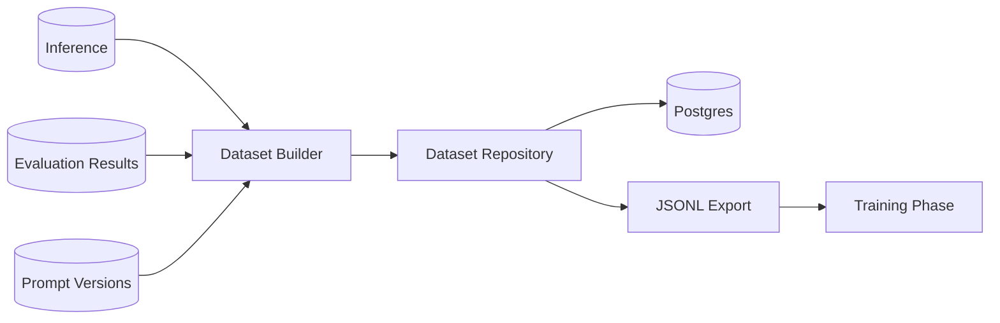
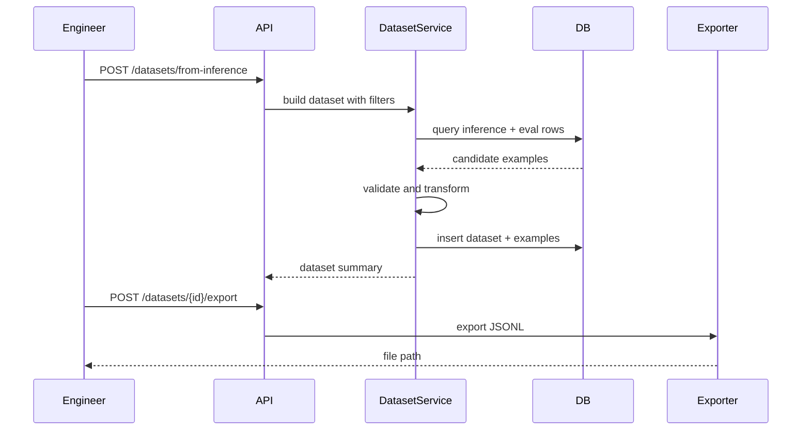

# 04 - Datasets

> Current state: not started. Inference and evaluation are implemented, so the
> raw material exists: `inference` rows and their `evaluation_results`. This phase
> curates those rows into reusable collections, reusing the existing repositories
> and the `(faithfulness, answer_relevance)` metrics arc-eval already returns.

## Purpose

The Datasets phase turns inference and evaluation history into structured examples for benchmarking and training.

Before this phase, the system records outputs and scores. Datasets give engineers a durable way to curate those records into reusable collections.

The system evolves from:

```text
Inference + EvaluationResult
```

to:

```text
Dataset -> DatasetExample -> Benchmarking and Training
```

## Why This Phase Comes After Prompt Management

Dataset examples must include enough lineage to remain meaningful over time.

A dataset row should answer:

- What was the input?
- What was the expected output?
- Which model produced the candidate output?
- Which prompt version was used?
- Which evaluation scores qualified this row?
- Can this row be reused for training or only benchmarking?

Prompt management provides the missing lineage needed to build reliable datasets.

## Goals

- Add `Dataset` and `DatasetExample` entities (append to the single-file modules).
- Generate datasets from scored inference rows, reusing `InferenceRepository` and `EvaluationResultRepository`.
- Support manual dataset examples.
- Export datasets to JSONL (streamed, not loaded into memory).
- Provide dataset validation.
- Prepare the data shape for phase 05 training.

## Non-goals

- Large-scale data labeling platform
- Human review UI
- Data warehouse integration
- Vector database
- Feature store
- Distributed dataset processing

## Repository Evolution

```text
src/arc_model_lab/
├── domain/__init__.py           # + Dataset, DatasetExample
├── services/dataset_service.py  # new: build / validate / export
├── db/
│   ├── models.py                # + DatasetRecord, DatasetExampleRecord
│   └── repositories.py          # + DatasetRepository
├── api/
│   ├── routes/datasets.py       # new
│   └── schemas/datasets.py      # new
└── cli/datasets.py              # new: create / from-inference / export
```

## System Architecture



## Domain Model

### Dataset

```python
@dataclass(frozen=True, slots=True)
class Dataset:
    id: UUID
    name: str
    description: str | None
    task_type: str
    version: int
    created_by: str | None
    created_at: datetime
```

### DatasetExample

```python
@dataclass(frozen=True, slots=True)
class DatasetExample:
    id: UUID
    dataset_id: UUID
    input_text: str
    target_output: str
    source_inference_id: UUID | None
    metadata: dict[str, Any]
    created_at: datetime
```

`target_output` is intentionally generic. For summarization, it represents the preferred summary.

## Database Design

```sql
CREATE TABLE datasets (
    id UUID PRIMARY KEY,
    name TEXT NOT NULL,
    description TEXT,
    task_type TEXT NOT NULL,
    version INTEGER NOT NULL DEFAULT 1,
    created_by TEXT,
    created_at TIMESTAMPTZ NOT NULL DEFAULT now()
);

CREATE TABLE dataset_examples (
    id UUID PRIMARY KEY,
    dataset_id UUID NOT NULL REFERENCES datasets(id),
    input_text TEXT NOT NULL,
    target_output TEXT NOT NULL,
    source_inference_id UUID REFERENCES inference(id),
    metadata JSONB NOT NULL DEFAULT '{}'::jsonb,
    created_at TIMESTAMPTZ NOT NULL DEFAULT now()
);
```

Indexes:

```sql
CREATE UNIQUE INDEX uq_datasets_name_version
    ON datasets(name, version);

CREATE INDEX ix_dataset_examples_dataset_id
    ON dataset_examples(dataset_id);

CREATE INDEX ix_dataset_examples_source_inference_id
    ON dataset_examples(source_inference_id);
```

## Dataset Creation Modes

### Manual

Engineer provides examples directly.

Useful for:

- seed datasets
- curated benchmarks
- known edge cases

### From inference logs

DatasetService queries inference and evaluation results, following the same keyset pattern as `InferenceRepository.list_unevaluated`.

Example selection rule (metrics arc-eval actually returns):

```text
task_type = summarization
faithfulness >= 0.85
answer_relevance >= 0.80
created_at within selected range
```

### From experiment results

DatasetService creates examples from a specific experiment.

Useful for converting a successful experiment into training data.

## Dataset Extraction Flow



## Export Format

For supervised fine-tuning:

```json
{"messages":[{"role":"user","content":"Summarize:\n<text>"},{"role":"assistant","content":"<summary>"}]}
```

For plain summarization pairs:

```json
{"input":"<source text>","target":"<summary>"}
```

The service should support both formats, but default to chat-style JSONL because most instruction-tuning libraries accept message-based data.

## Service Responsibilities

### DatasetService

Owns:

- creating datasets
- adding examples
- extracting examples from inference/eval history
- validating dataset examples
- exporting JSONL

Does not own:

- training
- model artifact creation
- prompt rendering
- evaluation scoring

## Validation Rules

Reject dataset examples when:

- input is empty
- target output is empty
- target output is longer than input for summarization unless explicitly allowed
- source inference cannot be found
- required evaluation thresholds are not met

Warn when:

- input is very long
- target output is very short
- example has no source inference
- prompt version is missing

## Make Targets

Follow the `<area>.<verb>` convention; see the Makefile appendix.

```make
make data.from-inference  # create a dataset from scored inference rows
make data.from-exp        # create a dataset from an experiment's results
make data.validate        # validate dataset integrity
make data.export          # export dataset to JSONL (streamed)
```

## CI/CD

No new pipeline shape. Add dataset validation and export tests to the existing test stage; commit small dataset fixtures for CI. See the CI/CD appendix.

## Testing Strategy

### Unit tests

- validation rules
- extraction filter logic
- JSONL formatting
- stats calculation

### Repository tests

- create dataset
- insert examples
- query examples
- source inference relationship

### Integration tests

- run inference
- evaluate inference
- create dataset from inference
- export JSONL

## Operational Considerations

Datasets can grow large. Do not load all examples into memory by default. Export should stream rows.

Add pagination to dataset example listing.

Avoid modifying dataset examples in place. Prefer new dataset versions.

## Definition of Done

- `Dataset` and `DatasetExample` exist in the single-file modules.
- Datasets can be created manually and from scored inference rows (reusing the existing repositories).
- Dataset examples preserve `source_inference_id` lineage.
- JSONL export is streamed and works for both chat and pair formats.
- Dataset validation exists.
- CI validates dataset fixtures and exports.

## Future Evolution

The next phase introduces Training.

Training should only begin after datasets exist because training without curated, validated examples produces untrustworthy model artifacts.
