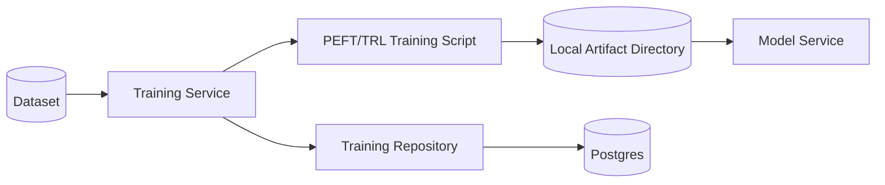
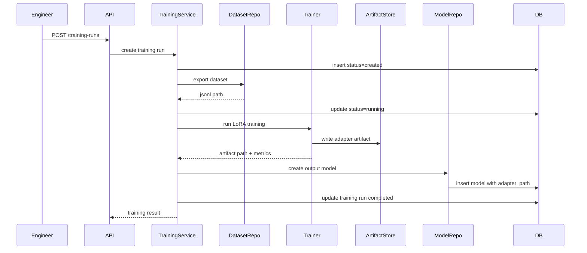

# 05 - Training

> Current state: not started. Depends on phase 04 (datasets). Training stays sync
> and CLI-driven, and its output becomes a new catalog `Model` row: the `models`
> table and the `Model.adapter_path` field already exist, so a trained adapter is
> registered, not bolted on. Training dependencies (PEFT/TRL) go in an optional
> dependency group so the serving image stays lean.

## Purpose

The Training phase introduces the ability to produce new model artifacts from curated datasets.

In this project, "training" is the umbrella term. Fine-tuning is the initial training method.

The first implementation should support lightweight LoRA/PEFT fine-tuning rather than full model training.

The system evolves from:

```text
Dataset -> DatasetExample
```

to:

```text
Dataset -> TrainingRun -> Model Artifact
```

## Training vs Fine-tuning

Training means any process that updates model weights or produces model adaptation artifacts.

Fine-tuning is a specific type of training where a pretrained model is adapted on a task-specific dataset.

For `arc-model-lab`, the initial training method is:

```text
LoRA fine-tuning using PEFT
```

The domain entity should be called `TrainingRun`, not `FineTuningRun`, because future methods may include:

- LoRA
- QLoRA
- continued pretraining
- preference optimization
- distillation

## Why This Phase Comes After Datasets

Training requires curated input-output examples. Datasets provide:

- input text
- target output
- source inference lineage
- prompt lineage
- evaluation-based filtering
- export format

Without datasets, training data would be ad hoc and irreproducible.

## Goals

- Add `TrainingRun` as a domain entity (append to the single-file modules).
- Train LoRA adapters from exported datasets (PEFT/TRL in an optional dependency group).
- Store training metadata and output artifact paths.
- Register the output adapter as a new catalog `Model` (reuse `ModelRepository`, set `adapter_path`).
- Provide local training smoke tests on a tiny dataset and model.
- Keep training synchronous and CLI-driven; add a queue only when duration forces it.

## Non-goals

- Distributed training
- GPU cluster orchestration
- Hyperparameter search
- Production training scheduler
- Automatic promotion
- Real-time training
- Full model fine-tuning

## Repository Evolution

```text
src/arc_model_lab/
├── domain/__init__.py            # + TrainingRun, TrainingStatus
├── services/training_service.py  # new: create run, invoke trainer, register output
├── db/
│   ├── models.py                 # + TrainingRunRecord
│   └── repositories.py           # + TrainingRepository
├── api/
│   ├── routes/training.py        # new
│   └── schemas/training.py       # new
├── cli/training.py               # new: create / run / smoke
└── training/train_lora.py        # the PEFT/TRL script (kept out of the request path)
```

## System Architecture



## Domain Model

### TrainingRun

```python
@dataclass(frozen=True, slots=True)
class TrainingRun:
    id: UUID
    dataset_id: UUID
    base_model_id: UUID
    output_model_id: UUID | None
    method: str
    status: str
    hyperparameters: dict[str, Any]
    artifact_path: str | None
    metrics: dict[str, Any]
    started_at: datetime | None
    completed_at: datetime | None
    created_at: datetime
```

Statuses:

```text
created
running
completed
failed
cancelled
```

Methods:

```text
lora
qlora
```

Initial implementation only needs `lora`.

## Database Design

```sql
CREATE TABLE training_runs (
    id UUID PRIMARY KEY,
    dataset_id UUID NOT NULL REFERENCES datasets(id),
    base_model_id UUID NOT NULL REFERENCES models(id),
    output_model_id UUID REFERENCES models(id),

    method TEXT NOT NULL,
    status TEXT NOT NULL,
    hyperparameters JSONB NOT NULL DEFAULT '{}'::jsonb,
    artifact_path TEXT,
    metrics JSONB NOT NULL DEFAULT '{}'::jsonb,

    started_at TIMESTAMPTZ,
    completed_at TIMESTAMPTZ,
    created_at TIMESTAMPTZ NOT NULL DEFAULT now()
);
```

Indexes:

```sql
CREATE INDEX ix_training_runs_dataset_id ON training_runs(dataset_id);
CREATE INDEX ix_training_runs_base_model_id ON training_runs(base_model_id);
CREATE INDEX ix_training_runs_status ON training_runs(status);
CREATE INDEX ix_training_runs_created_at ON training_runs(created_at);
```

## Training Flow



For local MVP, this can be synchronous and CLI-driven. Do not add a queue until training duration makes synchronous execution painful.

## Training Configuration

Example:

```json
{
  "dataset_id": "uuid",
  "base_model_id": "uuid",
  "method": "lora",
  "hyperparameters": {
    "epochs": 1,
    "learning_rate": 0.0002,
    "batch_size": 1,
    "lora_r": 8,
    "lora_alpha": 16,
    "max_seq_length": 1024
  }
}
```

## Artifact Layout

```text
artifacts/
└── models/
    └── qwen-summary-lora-v1/
        ├── adapter_config.json
        ├── adapter_model.safetensors
        ├── training_config.json
        └── metrics.json
```

Do not commit artifacts to Git.

Add to `.gitignore`:

```text
artifacts/
models/
.cache/
```

## Service Responsibilities

### TrainingService

Owns:

- creating training runs
- validating dataset and base model
- preparing dataset export
- invoking training script
- recording status transitions
- creating output model records

Does not own:

- inference
- prompt rendering
- evaluation scoring
- model promotion

### Training script

Owns:

- loading base model
- loading tokenizer
- loading dataset
- applying LoRA config
- executing training
- saving adapter

Keep the script simple and deterministic.

## Make Targets

Follow the `<area>.<verb>` convention; see the Makefile appendix.

```make
make train.run        # run local LoRA training from a config
make train.smoke      # train on a tiny fixture dataset and model
make train.evaluate   # evaluate the output model via arc-eval
make train.validate   # validate training config without training
```

## CI/CD

Never run full fine-tuning in PR CI. Add lightweight checks to the existing stage: training config validation, a trainer-script import test, and a tiny-dataset smoke test. A nightly scheduled smoke run (tiny dataset, tiny model) catches dependency breakage. See the CI/CD appendix.

## Testing Strategy

### Unit tests

- training run state transitions
- hyperparameter validation
- artifact path generation
- output model creation request

### Integration tests

- create dataset
- create training run
- fake trainer returns artifact
- model record created with adapter path

### Smoke tests

- tiny dataset
- tiny model
- one training step
- adapter file produced

## Operational Considerations

Training jobs are expensive compared to inference. Even in MVP, record:

- started_at
- completed_at
- failure reason
- hyperparameters
- artifact path
- base model
- dataset

Do not overwrite artifact directories. Each training run should produce immutable artifacts.

## Definition of Done

- `TrainingRun` and `TrainingRepository` exist in the single-file modules.
- Training run status lifecycle is implemented.
- A dataset can be exported and consumed by the LoRA trainer.
- The output adapter is produced as an immutable artifact.
- The output is registered as a catalog `Model` with `adapter_path` set.
- CI validates training config, trainer import, and a tiny-dataset smoke run.
- Full training never runs in PR CI; PEFT/TRL live in an optional dependency group.

## Future Evolution

The next phase introduces Model Registry.

Training produces artifacts. A registry is needed once artifacts require lifecycle management, comparison, promotion, and rollback.
