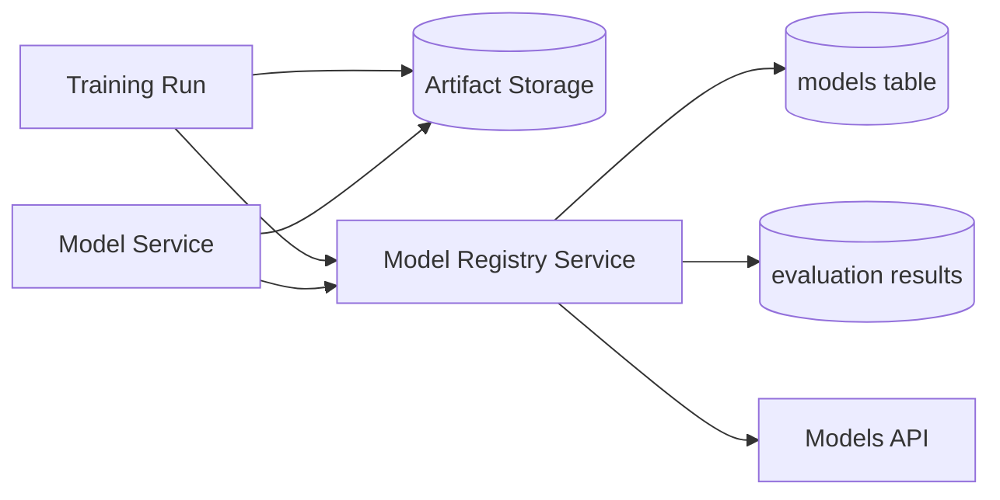
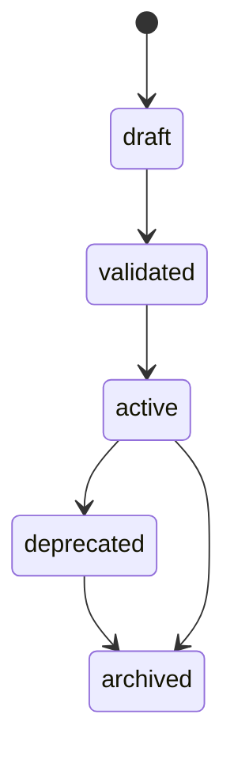

# 06 - Model Registry

> Current state: not started, but partly seeded. The `models` table already has
> `status` (active/inactive/deprecated + a `valid_status` check), a seed file, and
> a `model.*` CLI (list/get/activate/deactivate/smoke). This phase is a delta on
> that catalog: add artifact and lineage fields, widen the lifecycle states, and
> add a models HTTP API. It does not rebuild the catalog.

## Purpose

The Model Registry phase formalizes lifecycle management for model artifacts.

The catalog today records loadable models and their active/inactive status. After training exists, the system needs clearer semantics for:

- base models
- adapter artifacts
- trained variants
- promotion state
- rollback
- artifact validation

This phase evolves the `models` table into a lightweight enterprise-ready registry without introducing unnecessary platform complexity.

## Why This Phase Comes After Training

Before training, the service only has externally sourced models. A simple `models` table is enough.

After training, the service produces artifacts. Those artifacts need:

- ownership
- versioning
- immutability
- validation
- promotion
- rollback
- evaluation history

The registry is introduced only when model artifacts exist.

## Goals

- Keep `Model` as the domain name and keep existing fields (`revision`, `updated_at`, `status`).
- Add lifecycle fields: `artifact_uri`, `base_model_id`, `created_by_training_run_id`.
- Widen the status states for promotion (draft/validated/active/deprecated/archived).
- Add validation before a model can be promoted to active.
- Add a models HTTP API; today management is CLI-only.

## Non-goals

- Full MLflow replacement
- Global enterprise model registry
- Multi-tenant registry
- Model approval UI
- Automated canary rollout
- Model serving control plane

## Repository Evolution

```text
src/arc_model_lab/
├── domain/__init__.py                    # extend Model + ModelStatus
├── services/
│   ├── model_service.py                  # unchanged: loading/generation
│   └── model_registry_service.py         # new: metadata lifecycle
├── db/
│   ├── models.py                         # extend ModelRecord
│   └── repositories.py                   # extend ModelRepository (validate/promote)
├── api/
│   ├── routes/models.py                  # new: the models API
│   └── schemas/models.py                 # new
└── cli/models.py                         # extend: register / validate / deprecate
```

This phase can either extend `ModelService` or introduce `ModelRegistryService`.

Recommended:

- `ModelService` owns runtime loading/generation.
- `ModelRegistryService` owns metadata lifecycle.

## System Architecture



## Domain Model Evolution

### Model

Extend the existing entity; keep `revision` and `updated_at`.

```python
@dataclass(frozen=True, slots=True)
class Model:
    id: UUID
    name: str
    provider: str
    model_id: str
    tokenizer_id: str
    revision: str | None
    adapter_path: str | None
    artifact_uri: str | None                 # new
    base_model_id: UUID | None               # new
    created_by_training_run_id: UUID | None  # new
    status: str
    created_at: datetime
    updated_at: datetime
```

Statuses:

```text
draft
validated
active
deprecated
archived
```

Initial status rules:

- Base models can be `active`.
- Training outputs start as `draft`.
- A model must pass validation before `active`.
- Deprecated models remain loadable for reproducibility.
- Archived models should not be used for new inference.

## Database Migration

`status` and its check constraint already exist, so the migration adds only the new columns and widens the status states.

```sql
ALTER TABLE models
ADD COLUMN artifact_uri TEXT,
ADD COLUMN base_model_id UUID REFERENCES models(id),
ADD COLUMN created_by_training_run_id UUID REFERENCES training_runs(id);
```

Widen the existing `valid_status` check and migrate the old `inactive` value (map it to `archived`) in the same migration:

```sql
UPDATE models SET status = 'archived' WHERE status = 'inactive';

ALTER TABLE models DROP CONSTRAINT valid_status;
ALTER TABLE models ADD CONSTRAINT valid_status
CHECK (status IN ('draft', 'validated', 'active', 'deprecated', 'archived'));
```

Indexes:

```sql
CREATE INDEX ix_models_status ON models(status);
CREATE INDEX ix_models_base_model_id ON models(base_model_id);
CREATE INDEX ix_models_training_run_id ON models(created_by_training_run_id);
```

## Registry Lifecycle



## Registry Operations

Initial API:

```text
GET /models
GET /models/{model_id}
POST /models
POST /models/{model_id}/validate
POST /models/{model_id}/activate
POST /models/{model_id}/deprecate
```

Activation should be explicit and should not happen automatically after training.

## Validation Rules

A model can be marked `validated` when:

- artifact path exists
- tokenizer can be loaded
- model can generate a response
- smoke inference succeeds
- evaluation benchmark passes minimum thresholds if configured

## Service Responsibilities

### ModelRegistryService

Owns:

- creating model metadata
- validating artifacts
- changing model lifecycle status
- retrieving candidate models
- enforcing activation rules

Does not own:

- inference runtime execution
- training
- evaluation scoring

### ModelService update

ModelService should refuse to load archived models by default.

It may load deprecated models for historical reproducibility if explicitly requested.

## Make Targets

`model.list`, `model.get`, `model.activate`, and `model.smoke` already exist. This phase adds `register`, `validate`, and `deprecate`, and retires `deactivate` in favor of `deprecate`/`archive`. See the Makefile appendix.

```make
make model.register    # new: register a model/artifact from config
make model.validate    # new: validate artifact + smoke inference before promotion
make model.deprecate   # new: move an active model to deprecated
```

## CI/CD

No new pipeline shape. Add model lifecycle and artifact-validation tests to the existing stage, using the fake model runtime (no weight downloads in CI). Deployment must never auto-activate a newly trained model; activation is explicit. See the CI/CD appendix.

## Testing Strategy

### Unit tests

- lifecycle transitions
- invalid transition rejection
- archived load rejection
- validation result mapping

### Integration tests

- register model
- validate model
- activate model
- inference uses active model
- deprecated model remains queryable

## Operational Considerations

Model lifecycle metadata is business-critical.

Avoid destructive deletes. Prefer status transitions.

Every inference should keep referencing the exact model ID used at runtime even if the model is later deprecated or archived.

## Definition of Done

- `Model`/`ModelRecord`/`ModelStatus` extended with lifecycle fields; `revision` and `updated_at` preserved.
- Status states widened and the old `inactive` value migrated (up and down verified).
- `ModelRegistryService` and a models HTTP API exist (management is no longer CLI-only).
- Training output creates a `draft` model; validation promotes it to `active`.
- `ModelService` refuses to load `archived` models by default.
- The deployed-model `/inference` path resolves an `active` model.

## Future Evolution

The next phase introduces OpenTelemetry.

At this point the core business artifacts exist:

- models
- inference
- evaluation results
- experiments
- prompts
- datasets
- training runs

OpenTelemetry can now instrument meaningful business operations rather than unstable early prototypes.
