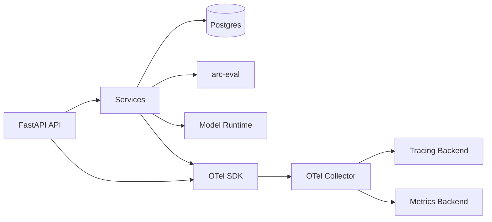
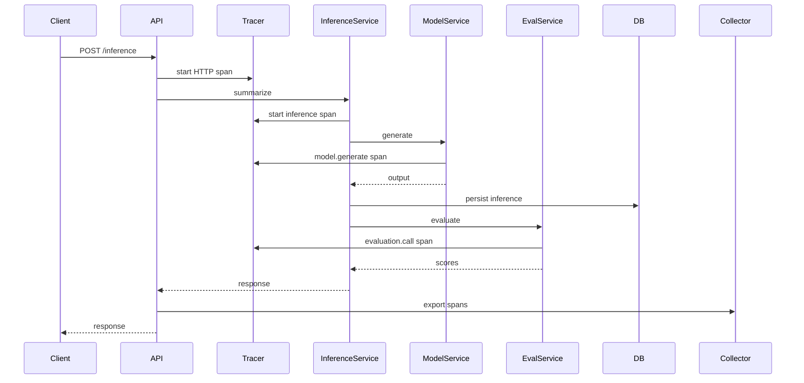

# 07 - OpenTelemetry

> Current state: not started, and intentionally last. The durable Postgres records
> and logs already answer most questions; OTel adds cross-boundary latency and
> failure visibility. It must be disabled by default and add zero required
> dependency in the request path when off. Spans follow the real `/inference`
> flow and the `InferenceWorkflow` seam.

## Purpose

The OpenTelemetry phase adds standardized traces and metrics for the stable `arc-model-lab` lifecycle.

OpenTelemetry is intentionally introduced after the core business model is stable. The service already persists durable business records in Postgres. OTel adds operational visibility across service boundaries, latency bottlenecks, and failure modes.

The system evolves from durable records only:

```text
Postgres records
```

to records plus runtime observability:

```text
Postgres records + traces + metrics
```

## Why This Phase Comes Last

OpenTelemetry should instrument stable workflows. If introduced too early, the team spends time tracing code paths that are still changing.

By this phase, the major workflows exist:

- inference
- evaluation
- experiment runs
- prompt rendering
- dataset export
- training runs
- model registry operations

These are meaningful operations to trace.

## Goals

- Add OpenTelemetry tracing to request lifecycle.
- Propagate trace IDs through inference, evaluation, dataset, training, and registry operations.
- Record model and inference identifiers as span attributes.
- Add metrics for latency, errors, and operation counts.
- Provide local collector setup.
- Extend CI/CD with trace smoke tests.

## Non-goals

- Replacing Postgres business records
- Logging full prompts as span attributes
- Building custom observability platform
- Adding vendor-specific instrumentation
- Tracing every low-level function

## Repository Evolution

```text
src/arc_model_lab/
├── services/
│   ├── inference_service.py
│   ├── evaluation_service.py
│   ├── experiment_service.py
│   ├── prompt_service.py
│   ├── dataset_service.py
│   ├── training_service.py
│   └── model_registry_service.py
│
├── observability/
│   ├── tracing.py
│   ├── metrics.py
│   └── instrumentation.py
│
├── config.py
└── main.py
```

Although earlier phases avoided an observability directory, it is justified here because observability is now a cross-cutting concern with enough surface area to isolate.

## System Architecture



## Trace Model

Recommended top-level spans (matching the `InferenceWorkflow` sequence):

```text
POST /inference
  inference.workflow
    prompt.render          # once phase 03 exists
    model.generate
    inference.persist
    evaluation.call        # only when metrics are requested
    evaluation.persist
```

Experiment run:

```text
POST /experiments/{id}/run
  experiment.run
    inference.summarize
    evaluation.call
    experiment.aggregate
```

Training run:

```text
POST /training-runs
  training.create
  training.prepare_dataset
  training.execute
  training.register_model
```

## Span Attributes

Use low-cardinality attributes where possible.

Safe attributes:

```text
arc.model.id
arc.model.name
arc.inference.id
arc.experiment.id
arc.prompt_version.id
arc.dataset.id
arc.training_run.id
arc.operation
arc.status
```

Avoid:

- full prompt text
- full input text
- full output text
- user secrets
- large metadata blobs

## Metrics

Initial metrics:

```text
arc_inference_requests_total
arc_inference_latency_ms
arc_inference_failures_total
arc_evaluation_requests_total
arc_evaluation_latency_ms
arc_training_runs_total
arc_model_load_latency_ms
arc_model_generation_latency_ms
```

Tags:

```text
model_name
operation
status
environment
```

Avoid high-cardinality values such as raw inference IDs on metrics.

## Request Lifecycle



## Configuration

Add to `Settings` (they inherit the `ARC_` prefix, so `ARC_OTEL_ENABLED`, and so on):

```python
otel_enabled: bool = False
otel_service_name: str = "arc-model-lab"
otel_exporter_otlp_endpoint: str | None = None
otel_environment: str = "local"
```

Default local behavior must not require an OTel backend.

## Local Collector

Add optional local compose services:

```yaml
otel-collector:
  image: otel/opentelemetry-collector:latest
  ports:
    - "4317:4317"
    - "4318:4318"
```

Optional Jaeger:

```yaml
jaeger:
  image: jaegertracing/all-in-one:latest
  ports:
    - "16686:16686"
```

## Make Targets

See the Makefile appendix.

```make
make otel.up             # start local collector + Jaeger
make otel.down           # stop the observability stack
make otel.smoke          # make a request and verify spans are emitted
make otel.disabled-test  # verify the app works with OTel disabled
```

## CI/CD

No new pipeline shape. Add to the existing test stage: the OTel-disabled path (the default), instrumentation unit tests, and a no-sensitive-attribute check. See the CI/CD appendix.

## Testing Strategy

### Unit tests

- span attributes are constructed correctly
- sensitive fields are not attached
- instrumentation wrappers do not change business behavior

### Integration tests

- OTel disabled path
- OTel enabled with local collector
- trace ID attached to logs if logging supports it

### Smoke tests

- start collector
- make summarize request
- verify collector receives spans

## Operational Considerations

OpenTelemetry is not a source of truth for business artifacts.

Source of truth:

- inference table
- evaluation_results table
- experiments table
- datasets table
- training_runs table
- models table

OTel answers:

- what is slow?
- what failed?
- where did the request go?
- which external dependency caused latency?

## Definition of Done

- OTel can be enabled/disabled via config.
- API requests emit traces.
- Inference, model generation, eval calls, training, and registry actions have spans.
- No prompt/input/output payloads are stored as span attributes.
- Local collector works through Make targets.
- CI validates app behavior with OTel disabled.
- CI validates instrumentation does not leak sensitive data.
- Deployment config includes OTel endpoint support.

## Future Evolution

After OTel, the platform can evolve toward production operations:

- dashboards
- SLOs
- alerts
- regression monitoring
- canary model rollout
- automated promotion gates
- cost and latency tracking

These should be introduced based on operational pain, not architectural speculation.
