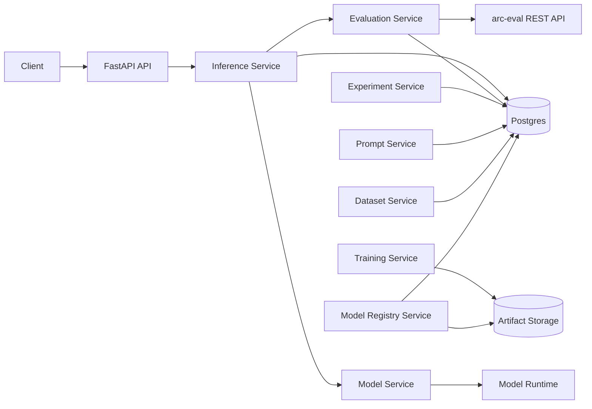

# arc-model-lab Architecture Handbook

## Purpose

This handbook defines the phased architecture for `arc-model-lab`, a model inference, evaluation, experimentation, dataset, training, registry, and observability service.

The project starts intentionally small:

```text
Model -> Inference -> Postgres
```

Then evolves into a closed-loop model improvement platform:

```text
Inference -> Evaluation -> Experiment -> Prompt -> Dataset -> Training -> Model Registry -> Observability
```

The guiding principle is simple:

> Build the smallest correct vertical slice first, then introduce new abstractions only when the system has produced real artifacts that require them.

## Design Philosophy

`arc-model-lab` is designed around the following engineering principles:

- Simplicity over premature generality
- Orthogonal module ownership
- Domain-first modeling
- Clear runtime boundaries
- Explicit database lineage
- CI/CD from the first slice
- Makefile-driven developer ergonomics
- Production readiness without platform bloat

The goal is not to build a theoretical ML platform. The goal is to create a maintainable, extendable, operable, evolvable, and scalable service that engineers can understand quickly and extend safely.

## Handbook Structure

Implementation order:

1. `00_initial_slice.md`  
   Establishes the first production-grade vertical slice: model inference and persistence.

2. `01_evaluation_integration.md`  
   Wires `arc-model-lab` to `arc-eval` through a REST boundary and persists evaluation results.

3. `02_experiments.md`  
   Introduces experiments as a grouping mechanism for comparable model and prompt runs.

4. `03_prompt_management.md`  
   Introduces prompt templates and prompt versions without coupling prompts to code deploys.

5. `04_datasets.md`  
   Turns inference and evaluation records into structured datasets for benchmarking and training.

6. `05_training.md`  
   Introduces training runs, LoRA/PEFT fine-tuning, and model artifact production.

7. `06_model_registry.md`  
   Evolves the original `models` table into a lightweight registry for artifacts, adapters, and promotion state.

8. `07_opentelemetry.md`  
   Adds OpenTelemetry tracing and metrics after the core business loop is stable.

## Final Target Architecture



## Preferred Repository Shape

The repository starts small and grows by capability.

```text
arc-model-lab/
├── pyproject.toml
├── uv.lock
├── README.md
├── Makefile
├── Dockerfile
├── compose.yaml
├── alembic.ini
├── migrations/
├── tests/
│
└── src/
    └── arc_model_lab/
        ├── api/
        ├── domain/
        ├── services/
        ├── db/
        ├── config.py
        └── main.py
```

## CI/CD Philosophy

Every phase extends the same pipeline instead of replacing it.

Base pull request pipeline:

```text
format check
  -> lint
  -> typecheck
  -> unit tests
  -> migration validation
  -> integration tests
  -> docker build
  -> security scan
```

Base merge pipeline:

```text
merge to main
  -> build immutable image
  -> push image
  -> deploy dev
  -> smoke test
  -> manual promotion
  -> deploy production
```

## Makefile Philosophy

The Makefile is the canonical developer interface. Engineers should not need to remember raw `uv`, `docker`, `alembic`, or `pytest` commands.

Common targets:

```make
make install
make format
make lint
make typecheck
make test
make db.up
make db.down
make db.migrate
make db.revision
make run.api
make docker.build
make docker.run
```

## How to Use This Handbook

Read the documents in order. Each phase assumes the prior phase is already implemented and stable.

Do not skip phases. The order is intentional:

- Evaluation comes before experiments because experiments need scores.
- Experiments come before datasets because datasets need reproducible runs.
- Prompt management comes before datasets because prompt lineage affects dataset meaning.
- Datasets come before training because training requires curated examples.
- Training comes before model registry because training creates artifacts that require registry semantics.
- OpenTelemetry comes last because durable business records should exist before distributed traces.
