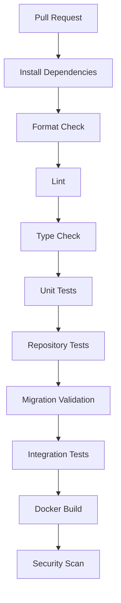
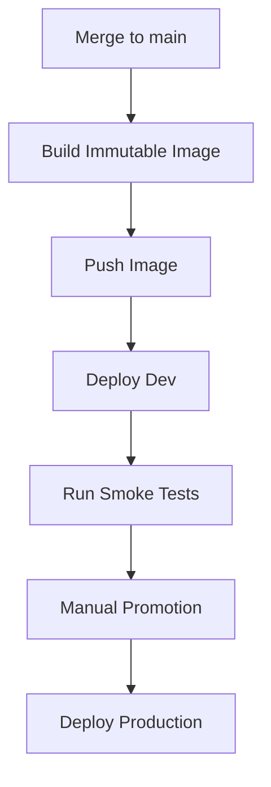

# Appendix - CI/CD Reference

## Purpose

This appendix defines the CI/CD philosophy for `arc-model-lab`. It is the canonical pipeline description; the phase docs defer here instead of redrawing it, and each phase only adds checks to the existing stages (see the table below).

The pipeline should remain simple, fast, and reliable. It validates correctness without expensive model downloads or full training jobs on every pull request. Lint covers Ruff format, Ruff check, and mypy on `src`; tests never download weights (fake model runtime) and never require a live arc-eval (mock or contract).

## Pull Request Pipeline

## Merge Pipeline

## Phase-specific Additions

| Phase | CI/CD Addition | Status |
|---|---|---|
| Initial Slice | migration validation, docker build, inference smoke test with fake runtime | implemented |
| Evaluation | arc-eval contract tests | implemented |
| Experiments | experiment comparison tests | planned |
| Prompt Management | prompt fixture rendering tests | planned |
| Datasets | dataset validation and JSONL export tests | planned |
| Training | training config validation and tiny smoke test | planned |
| Model Registry | lifecycle transition tests | planned |
| OpenTelemetry | OTel disabled/enabled smoke tests | planned |

## Production Deployment Principle

Do not automatically activate new models during deployment.

Code deployment and model promotion are separate operations.
